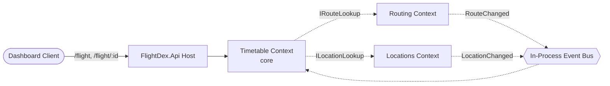
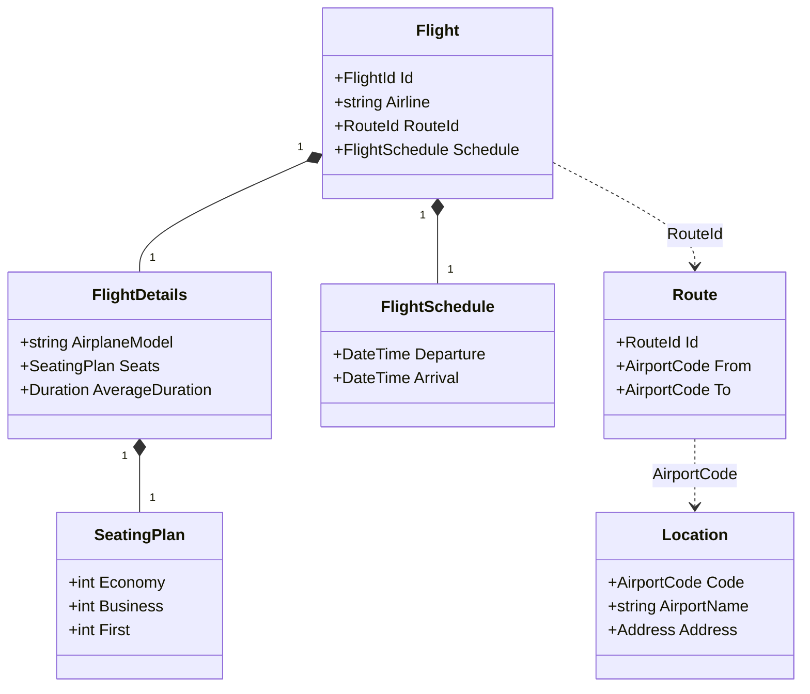
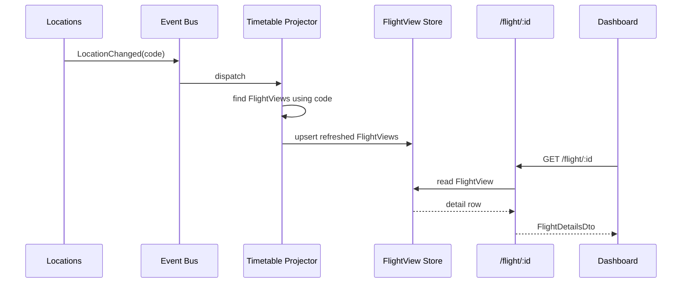

# Day 22 — Capstone kickoff: design + scaffold

## 1 Introduction
### 1.1 Project Overview
My Capstone project is FlightDex. It is a flight timetable web application with features to track flights by flight routes, airports, fares and locations. It also has feature to view additional flight details like Airplane Model, Seating Capacity, Averege Occupancy, Average Flight duration, Fares and number of seats by class.  For simplicity, in this project the data will be seeded in a database by a "Airline-admin" roles.

### 1.2 Current Slice
The current product slice taken for this task is the main timetable page. It displays in a paginated manner a timtetable of flights filtered or sorted by departure location, arrival location, location, airport and time. It can be used to view all flights by time or departing at your nearest airport. The current slice does not have users. They will be added later on and the currently assigned flight data will be allocated to the new seeded airline-admins.

Planed Slices for the full project:
- Slice 1- Timetable
- Slice 2- User Management and Tracked Flights
- Slice 3- Future feature updates

## 2. Design

## 2.1 Contexts

Timetable is the core context and the only one the dashboard talks to. Routing and Locations are supporting contexts that Timetable reads from to enrich a flight into a full detail view. Contexts never share tables; they exchange data through application-layer contracts and integration events.

```text
Dashboard
   |
   |  GET /flight , /flight/{flightId}
   v
FlightDex.Api  (single host)
   |
   v
Timetable (core) --IRouteLookup-----> Routing     (supporting)
   ^             --ILocationLookup---> Locations   (supporting)
   |
   |  dispatch
In-Process Event Bus <--RouteChanged------ Routing
                     <--LocationChanged---- Locations
```

- **Timetable** (core) — owns `Flight` + `FlightDetails`; serves the dashboard; builds the denormalized `FlightView` read model.
- **Routing** (supporting) — owns `Route`; resolves `RouteID` → from/to airport codes.
- **Locations** (supporting) — owns `Location`; resolves airport code → airport name + city/state/country.
- Dependency direction: `Timetable → Routing`, `Timetable → Locations` (read-only, via ports).
- No shared persistence; one schema per context, one host process.



## 2.2 Aggregates

`Flight` is the core aggregate root; `FlightDetails` is an entity inside its boundary, never loaded independently. `Route` and `Location` are independent aggregate roots in their own contexts, referenced only by identity (`RouteId`, `AirportCode`). `FlightView` is a denormalized read model, not an aggregate.

```text
Flight  (aggregate root)
  |-- FlightId
  |-- Airline
  |-- FlightSchedule (VO) -- Departure, Arrival
  |-- RouteId ............> Route  (root, Routing ctx)
  |                          |-- From: AirportCode ....> Location (root, Locations ctx)
  |                          '-- To:   AirportCode ....> Location
  '-- FlightDetails (entity)
        |-- AirplaneModel
        |-- SeatingPlan (VO) -- Economy, Business, First
        '-- AverageDuration

FlightView (read model) = flattened  Flight + Route + Location

  ....>  = reference by identity across a context boundary
```

- **Flight** (root) — `FlightId`, `Airline`, `RouteId`, `FlightSchedule` (departure/arrival), `FlightDetails`.
- **FlightDetails** (entity) — airplane model, `SeatingPlan` (economy/business/first), average duration.
- **FlightSchedule** (VO) — departure/arrival timestamps; derives duration.
- **SeatingPlan** (VO) — seat counts by class.
- **Route** (root) — `RouteId`, from `AirportCode`, to `AirportCode`.
- **Location** (root) — `AirportCode`, airport name, `Address` (city/state/country).
- **FlightView** (read model) — flattened flight + route + location fields for the detail panel.



## 2.3 — Async Flows

Detail reads are served from the `FlightView` read model so the dashboard never fans out to other contexts at request time. The view is kept fresh asynchronously: when a flight, route, or location changes, the owning context publishes an integration event to the in-process bus, and the Timetable projector rebuilds the affected `FlightView` rows.

```text
WRITE / refresh (async)
  Routing   --RouteChanged----+
                              +--> Event Bus --> Timetable Projector --> FlightView store
  Locations --LocationChanged-+                        |
                                                       |  pulls route + location
                                                       v       via ports
                                              Routing + Locations

READ (sync)
  Dashboard --GET /flight/{id}--> API --> FlightView store --> FlightDetailsDto
```

- **Query path** (sync) — `/flight/{id}` reads `FlightView` directly; no cross-context call.
- **FlightUpserted** — Timetable projects a new/updated `FlightView`, pulling route + location data via ports.
- **RouteChanged** — Routing publishes; Timetable refreshes views referencing that `RouteId`.
- **LocationChanged** — Locations publishes; Timetable refreshes views referencing that `AirportCode`.
- Bus is in-process (modular monolith); handlers run in the same host, swappable for a broker later.



## 3. Structure

```
FlightDex/
├── FlightDex.sln                                  # Solution wiring all module + host + test projects
├── Directory.Build.props                          # Shared MSBuild settings for every project
├── Design.md                                      # One-page design: contexts, aggregates, async flows
├── Structure.md                                   # This file: folder and file structure
│── D22P1_Solution.md                              # Solution of Day 22 Piece 2
│
├── diagrams/
│   ├── contexts.mmd                               # Section 1 mermaid: bounded-context map
│   ├── aggregates.mmd                             # Section 2 mermaid: Flight aggregate + references
│   └── async-flows.mmd                            # Section 3 mermaid: event refresh + read path
│
├── src/
│   ├── Bootstrap/
│   │   └── FlightDex.Api/                          # Web host and composition root
│   │       ├── FlightDex.Api.csproj
│   │       ├── Program.cs                          # App entry point; wires modules into the host
│   │       ├── appsettings.json                   # Host configuration
│   │       ├── Endpoints/
│   │       │   └── FlightEndpoints.cs              # Maps /flight and /flight/{flightId} routes
│   │       └── Modules/
│   │           └── ModuleRegistration.cs          # Registers each bounded context's services
│   │
│   ├── Shared/
│   │   ├── FlightDex.SharedKernel/                 # Cross-context domain primitives
│   │   │   ├── FlightDex.SharedKernel.csproj
│   │   │   ├── Domain/
│   │   │   │   ├── AggregateRoot.cs                # Base type for aggregate roots
│   │   │   │   ├── Entity.cs                       # Base type for entities
│   │   │   │   ├── ValueObject.cs                  # Base type for value objects
│   │   │   │   └── IDomainEvent.cs                 # Marker for domain events
│   │   │   ├── Pagination/
│   │   │   │   ├── PagedRequest.cs                 # Page number/size input contract
│   │   │   │   └── PagedResult.cs                  # Generic paginated response envelope
│   │   │   └── Abstractions/
│   │   │       └── IUnitOfWork.cs                  # Transaction boundary abstraction
│   │   │
│   │   └── FlightDex.IntegrationEvents/            # Public event contracts between contexts
│   │       ├── FlightDex.IntegrationEvents.csproj
│   │       ├── IEventBus.cs                        # In-process event bus abstraction
│   │       ├── IIntegrationEvent.cs                # Marker for integration events
│   │       ├── FlightUpsertedEvent.cs              # Raised when a flight is created/updated
│   │       ├── RouteChangedEvent.cs                # Raised when a route's endpoints change
│   │       └── LocationChangedEvent.cs             # Raised when a location's details change
│   │
│   └── Modules/
│       ├── Timetable/                              # CORE context: owns Flight + FlightDetails
│       │   ├── FlightDex.Timetable.Domain/
│       │   │   ├── FlightDex.Timetable.Domain.csproj
│       │   │   ├── Flight/
│       │   │   │   ├── Flight.cs                   # Flight aggregate root
│       │   │   │   ├── FlightDetails.cs            # Detail entity within the Flight aggregate
│       │   │   │   ├── FlightId.cs                 # Strongly-typed flight identifier
│       │   │   │   ├── SeatingPlan.cs              # Value object: seats by class
│       │   │   │   ├── FlightSchedule.cs           # Value object: departure/arrival timestamps
│       │   │   │   └── IFlightRepository.cs        # Persistence port for the Flight aggregate
│       │   │   └── ReadModels/
│       │   │       └── FlightView.cs               # Denormalized dashboard/detail read model
│       │   ├── FlightDex.Timetable.Application/
│       │   │   ├── FlightDex.Timetable.Application.csproj
│       │   │   ├── Queries/
│       │   │   │   ├── GetFlightTimetable/
│       │   │   │   │   ├── GetFlightTimetableQuery.cs    # Paginated timetable query input
│       │   │   │   │   └── GetFlightTimetableHandler.cs  # Returns a page of flight summaries
│       │   │   │   └── GetFlightDetails/
│       │   │   │       ├── GetFlightDetailsQuery.cs      # Single-flight detail query input
│       │   │   │       └── GetFlightDetailsHandler.cs    # Returns enriched flight details
│       │   │   ├── Contracts/
│       │   │   │   ├── FlightSummaryDto.cs         # Timetable row shape
│       │   │   │   └── FlightDetailsDto.cs         # Expanded detail panel shape
│       │   │   ├── Enrichment/
│       │   │   │   ├── IRouteLookup.cs             # Port to resolve RouteID -> airport codes
│       │   │   │   ├── ILocationLookup.cs          # Port to resolve airport code -> city/state/country
│       │   │   │   └── FlightViewProjector.cs      # Builds FlightView from flight + route + location
│       │   │   └── EventHandlers/
│       │   │       ├── RouteChangedHandler.cs      # Refreshes FlightViews on route change
│       │   │       └── LocationChangedHandler.cs   # Refreshes FlightViews on location change
│       │   └── FlightDex.Timetable.Infrastructure/
│       │       ├── FlightDex.Timetable.Infrastructure.csproj
│       │       ├── Persistence/
│       │       │   ├── TimetableDbContext.cs       # EF Core context for Flight/FlightDetails/FlightView
│       │       │   ├── FlightRepository.cs         # IFlightRepository implementation
│       │       │   └── Configurations/
│       │       │       ├── FlightConfiguration.cs        # Flight table mapping
│       │       │       ├── FlightDetailsConfiguration.cs # FlightDetails table mapping
│       │       │       └── FlightViewConfiguration.cs    # FlightView read-model mapping
│       │       ├── Lookups/
│       │       │   ├── RouteLookupAdapter.cs       # IRouteLookup over the Routing context
│       │       │   └── LocationLookupAdapter.cs    # ILocationLookup over the Locations context
│       │       └── TimetableModule.cs              # DI registration for the Timetable context
│       │
│       ├── Routing/                                # Owns Routes (RouteID -> from/to airport codes)
│       │   ├── FlightDex.Routing.Domain/
│       │   │   ├── FlightDex.Routing.Domain.csproj
│       │   │   ├── Route.cs                        # Route aggregate root
│       │   │   ├── RouteId.cs                      # Strongly-typed route identifier
│       │   │   ├── AirportCode.cs                  # Value object for airport code
│       │   │   └── IRouteRepository.cs             # Persistence port for routes
│       │   ├── FlightDex.Routing.Application/
│       │   │   ├── FlightDex.Routing.Application.csproj
│       │   │   ├── Queries/
│       │   │   │   └── GetRouteById/
│       │   │   │       ├── GetRouteByIdQuery.cs    # Route lookup input
│       │   │   │       └── GetRouteByIdHandler.cs  # Returns route endpoints
│       │   │   └── Contracts/
│       │   │       └── RouteDto.cs                 # Route endpoint shape exposed to other contexts
│       │   └── FlightDex.Routing.Infrastructure/
│       │       ├── FlightDex.Routing.Infrastructure.csproj
│       │       ├── Persistence/
│       │       │   ├── RoutingDbContext.cs         # EF Core context for Routes
│       │       │   ├── RouteRepository.cs          # IRouteRepository implementation
│       │       │   └── Configurations/
│       │       │       └── RouteConfiguration.cs   # Routes table mapping
│       │       └── RoutingModule.cs                # DI registration for the Routing context
│       │
│       └── Locations/                              # Owns Locations (airport code -> city/state/country)
│           ├── FlightDex.Locations.Domain/
│           │   ├── FlightDex.Locations.Domain.csproj
│           │   ├── Location.cs                     # Location aggregate root
│           │   ├── AirportCode.cs                  # Strongly-typed airport code identifier
│           │   ├── Address.cs                      # Value object: city/state/country
│           │   └── ILocationRepository.cs          # Persistence port for locations
│           ├── FlightDex.Locations.Application/
│           │   ├── FlightDex.Locations.Application.csproj
│           │   ├── Queries/
│           │   │   └── GetLocationByCode/
│           │   │       ├── GetLocationByCodeQuery.cs    # Location lookup input
│           │   │       └── GetLocationByCodeHandler.cs  # Returns location details
│           │   └── Contracts/
│           │       └── LocationDto.cs              # Location detail shape exposed to other contexts
│           └── FlightDex.Locations.Infrastructure/
│               ├── FlightDex.Locations.Infrastructure.csproj
│               ├── Persistence/
│               │   ├── LocationsDbContext.cs       # EF Core context for Locations
│               │   ├── LocationRepository.cs       # ILocationRepository implementation
│               │   └── Configurations/
│               │       └── LocationConfiguration.cs # Locations table mapping
│               └── LocationsModule.cs              # DI registration for the Locations context
│
└── tests/
    ├── FlightDex.Timetable.Tests/                  # Tests for the Timetable context
    │   └── FlightDex.Timetable.Tests.csproj
    ├── FlightDex.Routing.Tests/                    # Tests for the Routing context
    │   └── FlightDex.Routing.Tests.csproj
    └── FlightDex.Locations.Tests/                  # Tests for the Locations context
        └── FlightDex.Locations.Tests.csproj
```
