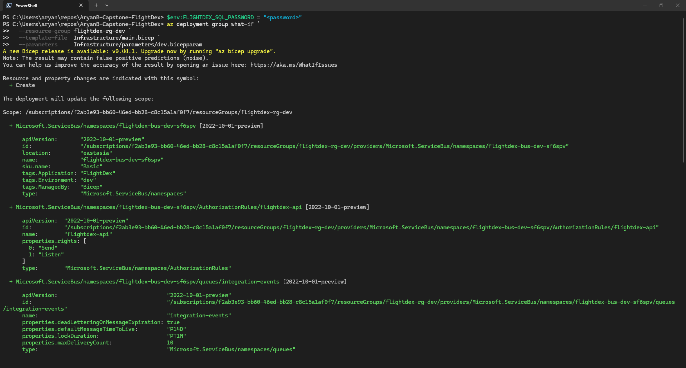
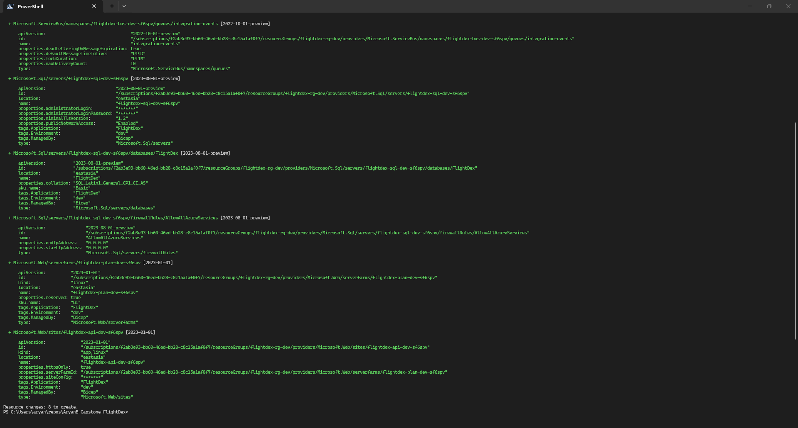

# Day 23 Piece 1 — FlightDex Infrastructure as Code (Bicep)
Set up the API and seeded around 10 entries to create a basic API for this excercise. Successfully wrote and verified the bicep IaC code.

## Repo layout

```
Infrastructure/
├── main.bicep                  # orchestrates all modules
├── modules/
│   ├── appService.bicep        # App Service Plan + Web App
│   ├── sql.bicep               # SQL Server + Database + firewall
│   └── serviceBus.bicep        # Namespace + queue + auth rule
└── parameters/
    ├── dev.bicepparam          # B1 / Basic / Basic   (~$18/month)
    └── prod.bicepparam         # S2 / Standard / Standard  (~$260/month)
```

---

## 1. main.bicep

```bicep
targetScope = 'resourceGroup'

@description('Short environment identifier.')
@allowed(['dev', 'prod'])
param environmentName string

@description('Azure region for all resources.')
param location string = resourceGroup().location

@description('SQL Server administrator login name.')
param sqlAdminUsername string = 'flightdexadmin'

@description('SQL Server administrator password.')
@secure()
param sqlAdminPassword string

@description('App Service Plan SKU (B1 for dev, S2 for prod).')
@allowed(['F1', 'B1', 'B2', 'S1', 'S2', 'S3', 'P1v3', 'P2v3'])
param appServiceSkuName string = 'B1'

@description('Azure SQL Database SKU name (Basic / S2 …).')
param sqlSkuName string = 'Basic'

@description('Azure SQL Database pricing tier (Basic / Standard / Premium).')
param sqlSkuTier string = 'Basic'

@description('Service Bus namespace SKU (Basic / Standard / Premium).')
@allowed(['Basic', 'Standard', 'Premium'])
param serviceBusSkuName string = 'Basic'

// Six-char suffix derived from the resource group so every name is globally unique.
var suffix = take(uniqueString(resourceGroup().id), 6)

var tags = {
  Application: 'FlightDex'
  Environment: environmentName
  ManagedBy:   'Bicep'
}

module sql 'modules/sql.bicep' = {
  name: 'deploy-sql-${environmentName}'
  params: {
    serverName:    'flightdex-sql-${environmentName}-${suffix}'
    databaseName:  'FlightDex'
    adminUsername: sqlAdminUsername
    adminPassword: sqlAdminPassword
    location:      location
    skuName:       sqlSkuName
    skuTier:       sqlSkuTier
    tags:          tags
  }
}

module bus 'modules/serviceBus.bicep' = {
  name: 'deploy-bus-${environmentName}'
  params: {
    namespaceName: 'flightdex-bus-${environmentName}-${suffix}'
    location:      location
    skuName:       serviceBusSkuName
    tags:          tags
  }
}

module app 'modules/appService.bicep' = {
  name: 'deploy-app-${environmentName}'
  params: {
    appName:                    'flightdex-api-${environmentName}-${suffix}'
    planName:                   'flightdex-plan-${environmentName}-${suffix}'
    location:                   location
    skuName:                    appServiceSkuName
    sqlServerFqdn:              sql.outputs.serverFqdn
    sqlDatabaseName:            sql.outputs.databaseName
    sqlAdminUsername:           sqlAdminUsername
    sqlAdminPassword:           sqlAdminPassword
    serviceBusConnectionString: bus.outputs.connectionString
    tags:                       tags
  }
}

output apiUrl             string = 'https://${app.outputs.defaultHostName}'
output sqlServerFqdn      string = sql.outputs.serverFqdn
output serviceBusEndpoint string = bus.outputs.endpoint
```

---

## 2. Module: appService.bicep

```bicep
@description('Web app name — must be globally unique.')
param appName string

@description('App Service Plan name.')
param planName string

@description('Azure region.')
param location string

@description('App Service Plan SKU.')
@allowed(['F1', 'B1', 'B2', 'S1', 'S2', 'S3', 'P1v3', 'P2v3'])
param skuName string = 'B1'

@description('SQL Server fully-qualified domain name.')
param sqlServerFqdn string

@description('SQL Database name.')
param sqlDatabaseName string

@description('SQL Server administrator login.')
param sqlAdminUsername string

@description('SQL Server administrator password.')
@secure()
param sqlAdminPassword string

@description('Service Bus primary connection string (Send + Listen).')
@secure()
param serviceBusConnectionString string

param tags object = {}

// Built here so the password never surfaces in an output.
var sqlConnectionString = 'Server=tcp:${sqlServerFqdn},1433;Database=${sqlDatabaseName};User Id=${sqlAdminUsername};Password=${sqlAdminPassword};Encrypt=True;TrustServerCertificate=False;MultipleActiveResultSets=True;'

resource plan 'Microsoft.Web/serverfarms@2023-01-01' = {
  name: planName
  location: location
  tags: tags
  sku: {
    name: skuName
  }
  kind: 'linux'
  properties: {
    reserved: true   // required for Linux plans
  }
}

resource webApp 'Microsoft.Web/sites@2023-01-01' = {
  name: appName
  location: location
  tags: tags
  kind: 'app,linux'
  properties: {
    serverFarmId: plan.id
    httpsOnly: true
    siteConfig: {
      linuxFxVersion: 'DOTNETCORE|10.0'
      http20Enabled: true
      minTlsVersion: '1.2'
      ftpsState: 'Disabled'
      appSettings: [
        {
          name: 'ASPNETCORE_ENVIRONMENT'
          value: 'Production'
        }
        {
          name: 'ServiceBus__ConnectionString'
          value: serviceBusConnectionString
        }
      ]
      connectionStrings: [
        {
          name: 'FlightDex'
          connectionString: sqlConnectionString
          type: 'SQLAzure'
        }
      ]
    }
  }
}

output defaultHostName string = webApp.properties.defaultHostName
output webAppId        string = webApp.id
```

---

## 3. dev/prod params

### 3.1 parameters/dev.bicepparam

```bicep
using '../main.bicep'

// Cheapest SKUs — suitable for CI and developer testing.
// sqlAdminPassword sourced from env var at deploy time (never committed).

param environmentName   = 'dev'
param location          = 'eastasia'
param sqlAdminUsername  = 'flightdexadmin'
param sqlAdminPassword  = readEnvironmentVariable('FLIGHTDEX_SQL_PASSWORD')

// App Service: B1 (Basic, 1 core / 1.75 GB) — ~$13/month
param appServiceSkuName = 'B1'

// SQL Database: Basic (5 DTU) — ~$5/month
param sqlSkuName        = 'Basic'
param sqlSkuTier        = 'Basic'

// Service Bus: Basic (queues only) — pay-per-operation
param serviceBusSkuName = 'Basic'
```

---

### 3.2 parameters/prod.bicepparam

```bicep
using '../main.bicep'

// Production-grade SKUs with SLA backing.
// sqlAdminPassword injected from CI secret / Key Vault reference.

param environmentName   = 'prod'
param location          = 'eastasia'
param sqlAdminUsername  = 'flightdexadmin'
param sqlAdminPassword  = readEnvironmentVariable('FLIGHTDEX_SQL_PASSWORD')

// App Service: S2 (Standard, 2 cores / 3.5 GB, custom domains + SSL) — ~$100/month
param appServiceSkuName = 'S2'

// SQL Database: S2 Standard (50 DTU) — ~$150/month
param sqlSkuName        = 'S2'
param sqlSkuTier        = 'Standard'

// Service Bus: Standard (queues + topics, 10 M ops/month included) — ~$10/month
param serviceBusSkuName = 'Standard'
```

---

## Deploy commands

```powershell
# Set secret once per shell session (never committed)
$env:FLIGHTDEX_SQL_PASSWORD = "<password>"

# ── Dev what-if ───────────────────────────────────────────────────────────────
az deployment group what-if `
  --resource-group flightdex-rg-dev `
  --template-file  Infrastructure/main.bicep `
  --parameters     Infrastructure/parameters/dev.bicepparam

# ── Dev deploy ────────────────────────────────────────────────────────────────
az deployment group create `
  --resource-group flightdex-rg-dev `
  --template-file  Infrastructure/main.bicep `
  --parameters     Infrastructure/parameters/dev.bicepparam `
  --name           flightdex-dev

# ── Prod deploy (same pattern, different params file) ─────────────────────────
az deployment group create `
  --resource-group flightdex-rg-prod `
  --template-file  Infrastructure/main.bicep `
  --parameters     Infrastructure/parameters/prod.bicepparam `
  --name           flightdex-prod
```

---

## 4. what-if output (dev)

```
PS C:\Users\aryan\repos\AryanB-Capstone-FlightDex> $env:FLIGHTDEX_SQL_PASSWORD = "<password>"
PS C:\Users\aryan\repos\AryanB-Capstone-FlightDex> az deployment group what-if `
>>   --resource-group flightdex-rg-dev `
>>   --template-file  Infrastructure/main.bicep `
>>   --parameters     Infrastructure/parameters/dev.bicepparam
A new Bicep release is available: v0.44.1. Upgrade now by running "az bicep upgrade".
Note: The result may contain false positive predictions (noise).
You can help us improve the accuracy of the result by opening an issue here: https://aka.ms/WhatIfIssues

Resource and property changes are indicated with this symbol:
  + Create

The deployment will update the following scope:

Scope: /subscriptions/f2ab3e93-bb60-46ed-bb28-c8c15a1af0f7/resourceGroups/flightdex-rg-dev

  + Microsoft.ServiceBus/namespaces/flightdex-bus-dev-sf6spv [2022-10-01-preview]

      apiVersion:       "2022-10-01-preview"
      id:               "/subscriptions/f2ab3e93-bb60-46ed-bb28-c8c15a1af0f7/resourceGroups/flightdex-rg-dev/providers/Microsoft.ServiceBus/namespaces/flightdex-bus-dev-sf6spv"
      location:         "eastasia"
      name:             "flightdex-bus-dev-sf6spv"
      sku.name:         "Basic"
      tags.Application: "FlightDex"
      tags.Environment: "dev"
      tags.ManagedBy:   "Bicep"
      type:             "Microsoft.ServiceBus/namespaces"

  + Microsoft.ServiceBus/namespaces/flightdex-bus-dev-sf6spv/AuthorizationRules/flightdex-api [2022-10-01-preview]

      apiVersion:  "2022-10-01-preview"
      id:          "/subscriptions/f2ab3e93-bb60-46ed-bb28-c8c15a1af0f7/resourceGroups/flightdex-rg-dev/providers/Microsoft.ServiceBus/namespaces/flightdex-bus-dev-sf6spv/AuthorizationRules/flightdex-api"
      name:        "flightdex-api"
      properties.rights: [
        0: "Send"
        1: "Listen"
      ]
      type:        "Microsoft.ServiceBus/namespaces/AuthorizationRules"

  + Microsoft.ServiceBus/namespaces/flightdex-bus-dev-sf6spv/queues/integration-events [2022-10-01-preview]

      apiVersion:                                  "2022-10-01-preview"
      id:                                          "/subscriptions/f2ab3e93-bb60-46ed-bb28-c8c15a1af0f7/resourceGroups/flightdex-rg-dev/providers/Microsoft.ServiceBus/namespaces/flightdex-bus-dev-sf6spv/queues/integration-events"
      name:                                        "integration-events"
      properties.deadLetteringOnMessageExpiration: true
      properties.defaultMessageTimeToLive:         "P14D"
      properties.lockDuration:                     "PT1M"
      properties.maxDeliveryCount:                 10
      type:                                        "Microsoft.ServiceBus/namespaces/queues"

  + Microsoft.Sql/servers/flightdex-sql-dev-sf6spv [2023-08-01-preview]

      apiVersion:                            "2023-08-01-preview"
      id:                                    "/subscriptions/f2ab3e93-bb60-46ed-bb28-c8c15a1af0f7/resourceGroups/flightdex-rg-dev/providers/Microsoft.Sql/servers/flightdex-sql-dev-sf6spv"
      location:                              "eastasia"
      name:                                  "flightdex-sql-dev-sf6spv"
      properties.administratorLogin:         "*******"
      properties.administratorLoginPassword: "*******"
      properties.minimalTlsVersion:          "1.2"
      properties.publicNetworkAccess:        "Enabled"
      tags.Application:                      "FlightDex"
      tags.Environment:                      "dev"
      tags.ManagedBy:                        "Bicep"
      type:                                  "Microsoft.Sql/servers"

  + Microsoft.Sql/servers/flightdex-sql-dev-sf6spv/databases/FlightDex [2023-08-01-preview]

      apiVersion:           "2023-08-01-preview"
      id:                   "/subscriptions/f2ab3e93-bb60-46ed-bb28-c8c15a1af0f7/resourceGroups/flightdex-rg-dev/providers/Microsoft.Sql/servers/flightdex-sql-dev-sf6spv/databases/FlightDex"
      location:             "eastasia"
      name:                 "FlightDex"
      properties.collation: "SQL_Latin1_General_CP1_CI_AS"
      sku.name:             "Basic"
      tags.Application:     "FlightDex"
      tags.Environment:     "dev"
      tags.ManagedBy:       "Bicep"
      type:                 "Microsoft.Sql/servers/databases"

  + Microsoft.Sql/servers/flightdex-sql-dev-sf6spv/firewallRules/AllowAllAzureServices [2023-08-01-preview]

      apiVersion:                "2023-08-01-preview"
      id:                        "/subscriptions/f2ab3e93-bb60-46ed-bb28-c8c15a1af0f7/resourceGroups/flightdex-rg-dev/providers/Microsoft.Sql/servers/flightdex-sql-dev-sf6spv/firewallRules/AllowAllAzureServices"
      name:                      "AllowAllAzureServices"
      properties.endIpAddress:   "0.0.0.0"
      properties.startIpAddress: "0.0.0.0"
      type:                      "Microsoft.Sql/servers/firewallRules"

  + Microsoft.Web/serverfarms/flightdex-plan-dev-sf6spv [2023-01-01]

      apiVersion:          "2023-01-01"
      id:                  "/subscriptions/f2ab3e93-bb60-46ed-bb28-c8c15a1af0f7/resourceGroups/flightdex-rg-dev/providers/Microsoft.Web/serverfarms/flightdex-plan-dev-sf6spv"
      kind:                "linux"
      location:            "eastasia"
      name:                "flightdex-plan-dev-sf6spv"
      properties.reserved: true
      sku.name:            "B1"
      tags.Application:    "FlightDex"
      tags.Environment:    "dev"
      tags.ManagedBy:      "Bicep"
      type:                "Microsoft.Web/serverfarms"

  + Microsoft.Web/sites/flightdex-api-dev-sf6spv [2023-01-01]

      apiVersion:              "2023-01-01"
      id:                      "/subscriptions/f2ab3e93-bb60-46ed-bb28-c8c15a1af0f7/resourceGroups/flightdex-rg-dev/providers/Microsoft.Web/sites/flightdex-api-dev-sf6spv"
      kind:                    "app,linux"
      location:                "eastasia"
      name:                    "flightdex-api-dev-sf6spv"
      properties.httpsOnly:    true
      properties.serverFarmId: "/subscriptions/f2ab3e93-bb60-46ed-bb28-c8c15a1af0f7/resourceGroups/flightdex-rg-dev/providers/Microsoft.Web/serverfarms/flightdex-plan-dev-sf6spv"
      properties.siteConfig:   "*******"
      tags.Application:        "FlightDex"
      tags.Environment:        "dev"
      tags.ManagedBy:          "Bicep"
      type:                    "Microsoft.Web/sites"

Resource changes: 8 to create.
```

Output Screenshots:


