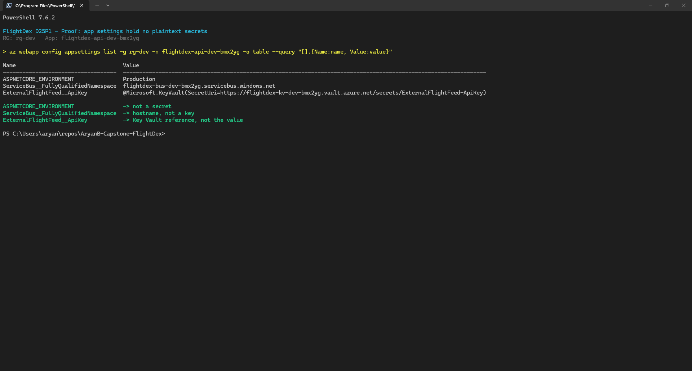
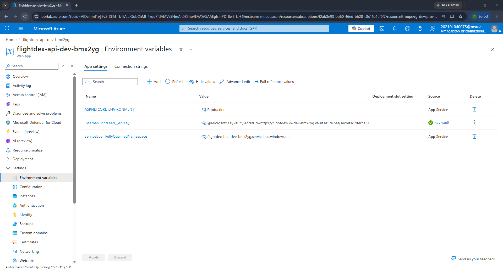
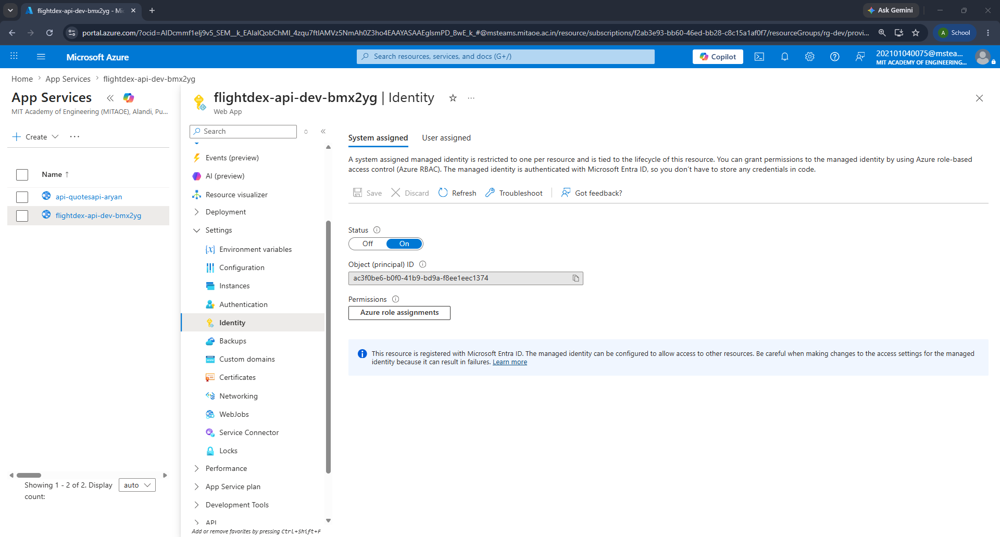
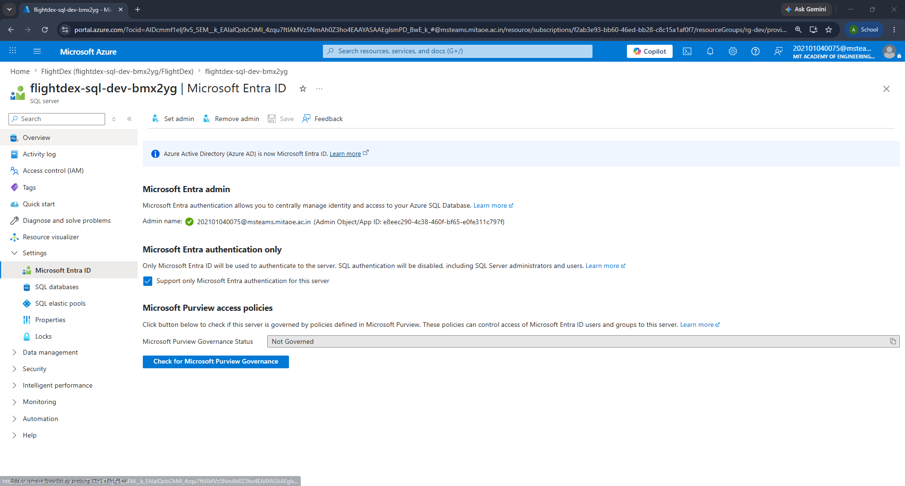
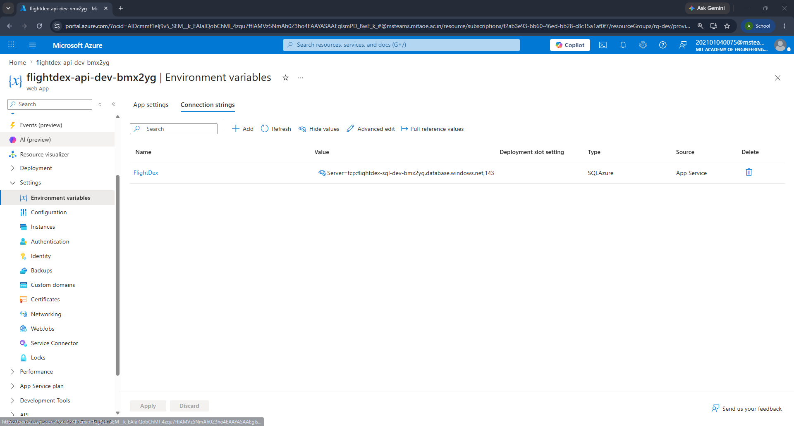
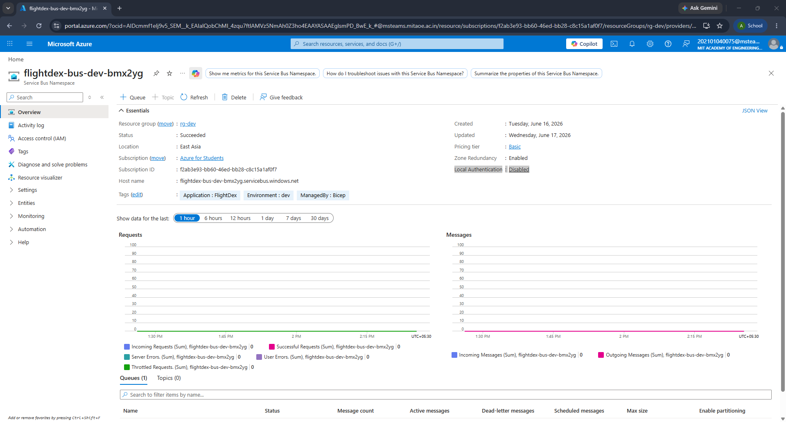
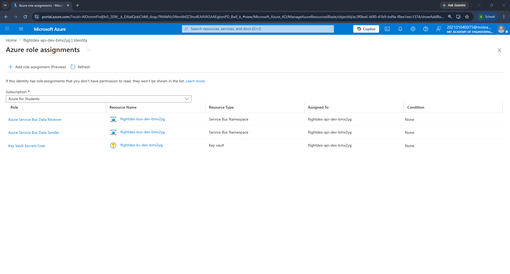
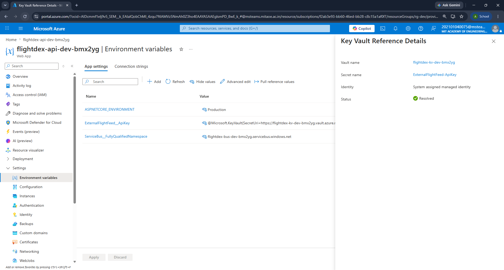
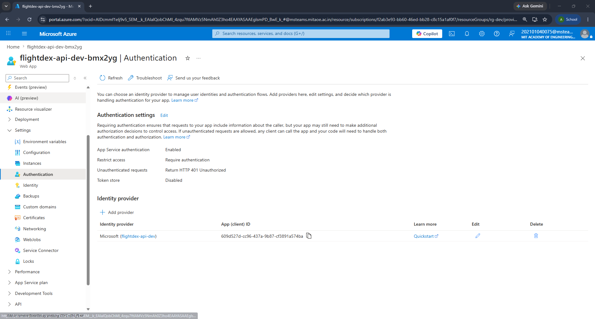

# Day 25 Part 1 — Identity End-to-End

The API now reaches SQL and Service Bus with its **managed identity**, the one secret it
can't replace with a token sits behind a **Key Vault reference**, and the front door is
gated by **Entra ID** — so the App Service settings hold zero plaintext secrets.

---

## 1. The Managed Identity wiring

### 1.1 System-assigned identity on the Web App

The web app turns on a system-assigned managed identity — the single principal every
downstream grant is made to (`Infrastructure/modules/appService.bicep`).

```bicep
resource webApp 'Microsoft.Web/sites@2023-01-01' = {
  name: appName
  identity: {
    type: 'SystemAssigned'
  }
  ...
}

output principalId string = webApp.identity.principalId
```

### 1.2 API → SQL (Entra token, no password)

The SQL server is provisioned Entra-only, so there is no admin login or password to leak
and password auth is rejected outright (`Infrastructure/modules/sql.bicep`).

```bicep
resource server 'Microsoft.Sql/servers@2023-08-01-preview' = {
  name: serverName
  properties: {
    version:             '12.0'
    minimalTlsVersion:   '1.2'
    publicNetworkAccess: 'Enabled'
    // No administratorLogin / administratorLoginPassword.
    administrators: {
      administratorType:         'ActiveDirectory'
      principalType:             aadAdminPrincipalType
      login:                     aadAdminLogin
      sid:                       aadAdminObjectId
      tenantId:                  subscription().tenantId
      azureADOnlyAuthentication: true   // password auth is rejected outright
    }
  }
}
```

The connection string carries no credential — the driver fetches an Entra token through
the MI, and the application code still just reads `GetConnectionString("FlightDex")`.

```bicep
var sqlConnectionString = 'Server=tcp:${sqlServerFqdn},1433;Database=${sqlDatabaseName};Authentication=Active Directory Default;Encrypt=True;TrustServerCertificate=False;MultipleActiveResultSets=True;'
```

A one-time post-deploy script, run as the Entra admin against the `FlightDex` DB, maps the
MI to a contained user with least-privilege roles. The login name is the web app's name.

```sql
CREATE USER [flightdex-api-dev-bmx2yg] FROM EXTERNAL PROVIDER;
ALTER ROLE db_datareader ADD MEMBER [flightdex-api-dev-bmx2yg];
ALTER ROLE db_datawriter ADD MEMBER [flightdex-api-dev-bmx2yg];
ALTER ROLE db_ddladmin   ADD MEMBER [flightdex-api-dev-bmx2yg];  -- EnsureCreated / migrations
```

### 1.3 API → Service Bus (RBAC, no SAS key)

The namespace disables local SAS auth entirely and emits no connection string, so the MI
is the only way in (`Infrastructure/modules/serviceBus.bicep`).

```bicep
resource namespace 'Microsoft.ServiceBus/namespaces@2022-10-01-preview' = {
  name: namespaceName
  properties: {
    disableLocalAuth: true   // identity is the only way in
  }
}

output fullyQualifiedNamespace string = '${namespace.name}.servicebus.windows.net'
```

The app gets only the hostname, and the MI is granted Send + Receive over RBAC
(`Infrastructure/modules/rbac.bicep`). The client connects with
`new ServiceBusClient(fqns, new DefaultAzureCredential())`.

```bicep
var sbDataSenderRoleId   = '69a216fc-b8fb-44d8-bc22-1f3c2cd27a39' // Service Bus Data Sender
var sbDataReceiverRoleId = '4f6d3b9b-027b-4f4c-9142-0e5a2a2247e0' // Service Bus Data Receiver

resource sbSender 'Microsoft.Authorization/roleAssignments@2022-04-01' = {
  scope: serviceBusNamespace
  name: guid(serviceBusNamespace.id, principalId, sbDataSenderRoleId)
  properties: {
    roleDefinitionId: subscriptionResourceId('Microsoft.Authorization/roleDefinitions', sbDataSenderRoleId)
    principalId:      principalId          // the web app's MI
    principalType:    'ServicePrincipal'
  }
}
// (sbReceiver is identical with the Data Receiver role id)
```

### 1.4 Entra ID for app auth (Easy Auth)

The front door is fronted by Entra ID: unauthenticated calls return 401, and a token from
the registered app is required (`Infrastructure/modules/appService.bicep`).

```bicep
resource authSettings 'Microsoft.Web/sites/config@2023-01-01' = if (!empty(entraAuthClientId)) {
  parent: webApp
  name: 'authsettingsV2'
  properties: {
    globalValidation: {
      requireAuthentication:       true
      unauthenticatedClientAction: 'Return401'
    }
    identityProviders: {
      azureActiveDirectory: {
        enabled: true
        registration: {
          openIdIssuer: '${environment().authentication.loginEndpoint}${subscription().tenantId}/v2.0'
          clientId:     entraAuthClientId
        }
        validation: {
          allowedAudiences: [ 'api://${entraAuthClientId}' ]
        }
      }
    }
  }
}
```

The app registration is created once and its client ID is wired in before provisioning.

```pwsh
$clientId = az ad app create --display-name "flightdex-api-dev" `
  --query appId -o tsv
az ad app update --id $clientId --identifier-uris "api://$clientId"
azd env set ENTRA_AUTH_CLIENT_ID $clientId -e dev
azd provision -e dev
```

### 1.5 Dependency order

`main.bicep` deploys `sql`, `bus`, and `kv` first, then `app` (which emits `principalId`),
and `rbac` last — so every role assignment targets a principal that already exists.

```bicep
module app  'modules/appService.bicep' = { ... }          // creates the MI
module rbac 'modules/rbac.bicep'        = {
  params: {
    principalId:             app.outputs.principalId       // SB Sender/Receiver + KV Secrets User
    serviceBusNamespaceName: bus.outputs.namespaceName
    keyVaultName:            kv.outputs.vaultName
  }
}
```

---

## 2. A Key Vault reference

Once SQL and Service Bus run on identity, the only sensitive value left is the external
flight-feed API key — a third party issues it, so a token can't replace it. It lives in
Key Vault and reaches the app only as a reference, never as a setting value.

The vault uses RBAC, and the secret is exported through a versionless URI so rotation
flows through without redeploying the app (`Infrastructure/modules/keyVault.bicep`).

```bicep
resource vault 'Microsoft.KeyVault/vaults@2023-07-01' = {
  name: vaultName
  properties: {
    tenantId: subscription().tenantId
    sku: { family: 'A', name: 'standard' }
    enableRbacAuthorization: true     // RBAC, not access policies
    enableSoftDelete:        true
  }
}

resource secret 'Microsoft.KeyVault/vaults/secrets@2023-07-01' = {
  parent: vault
  name: 'ExternalFlightFeed-ApiKey'
  properties: { value: externalFeedApiKey }
}

// Versionless URI so rotation flows through without redeploying the app.
output secretUri string = '${vault.properties.vaultUri}secrets/${secret.name}'
```

The app setting holds the reference, not the value — App Service resolves it at runtime
through the MI (`Infrastructure/modules/appService.bicep`).

```bicep
{
  name:  'ExternalFlightFeed__ApiKey'
  value: '@Microsoft.KeyVault(SecretUri=${keyVaultSecretUri})'
}
```

The Key Vault Secrets User grant is what makes the reference resolve
(`Infrastructure/modules/rbac.bicep`).

```bicep
var kvSecretsUserRoleId = '4633458b-17de-408a-b874-0445c86b69e6' // Key Vault Secrets User

resource kvSecretsUser 'Microsoft.Authorization/roleAssignments@2022-04-01' = {
  scope: keyVault
  name: guid(keyVault.id, principalId, kvSecretsUserRoleId)
  properties: {
    roleDefinitionId: subscriptionResourceId('Microsoft.Authorization/roleDefinitions', kvSecretsUserRoleId)
    principalId:      principalId
    principalType:    'ServicePrincipal'
  }
}
```

---

## 3. Proof: No Plaintext Secrets in App

Read every app setting straight off the live app — the only values present are an
environment name, a hostname, and a Key Vault reference, none of them a credential.

The CLI pulls the settings table directly from the running app.

```pwsh
$rg  = 'rg-dev'
$app = (az webapp list -g $rg --query "[0].name" -o tsv)
az webapp config appsettings list -g $rg -n $app `
  -o table --query "[].{Name:name, Value:value}"
```

```text
Name                                  Value
------------------------------------  ----------------------------------------------------------
ASPNETCORE_ENVIRONMENT                Production
ServiceBus__FullyQualifiedNamespace   flightdex-bus-dev-bmx2yg.servicebus.windows.net
ExternalFlightFeed__ApiKey            @Microsoft.KeyVault(SecretUri=https://flightdex-kv-dev-bmx2yg.vault.azure.net/secrets/ExternalFlightFeed-ApiKey)
```

- `ASPNETCORE_ENVIRONMENT` — not a secret.
- `ServiceBus__FullyQualifiedNamespace` — a hostname, not a key.
- `ExternalFlightFeed__ApiKey` — a Key Vault reference, not the value.

The live app settings from the CLI — none of the three values is a plaintext secret.



The same settings in the portal — the Service Bus value is a hostname and the feed key
reads `@Microsoft.KeyVault(...)` with a green check.



---

## 4. Complete Configuration

Every change pulls one more secret out of configuration and replaces it with identity.

| Area | What was configured | How access works now |
|------|---------------------|----------------------|
| Web App identity | System-assigned managed identity enabled | Single principal for all downstream grants |
| API → SQL | `Authentication=Active Directory Default` in the connection string | Driver fetches an Entra token via the MI — no `User Id` / `Password` |
| SQL server | `azureADOnlyAuthentication = true`, Entra admin set | Password auth rejected; Entra-only sign-in |
| SQL database | MI mapped to a contained user with `db_datareader` / `db_datawriter` / `db_ddladmin` | Least-privilege data + migration access |
| API → Service Bus | `disableLocalAuth = true`; app gets only the hostname | MI granted Data Sender + Data Receiver over RBAC |
| External feed key | Stored as a Key Vault secret, surfaced as `@Microsoft.KeyVault(...)` | Resolved at runtime via the Key Vault Secrets User grant |
| App auth | Easy Auth with the Entra ID provider | Unauthenticated requests return 401 |
| Deployment order | `sql` / `bus` / `kv` → `app` → `rbac` | Role assignments always target an existing principal |

System-assigned managed identity on the web app — Status On with an Object (principal) ID.



SQL server set to Microsoft Entra admin with "Support only Microsoft Entra authentication"
checked.



The FlightDex connection string uses `Authentication=Active Directory Default` — no
`User Id` or `Password`.



Service Bus namespace JSON view showing `"disableLocalAuth": true`.



The MI's Azure role assignments — Data Sender, Data Receiver, and Key Vault Secrets User.



The Key Vault reference setting shows source Key Vault Reference with a green Resolved
status; the value is never displayed.



App Service authentication enabled, unauthenticated requests returning HTTP 401, with the
Microsoft identity provider.


