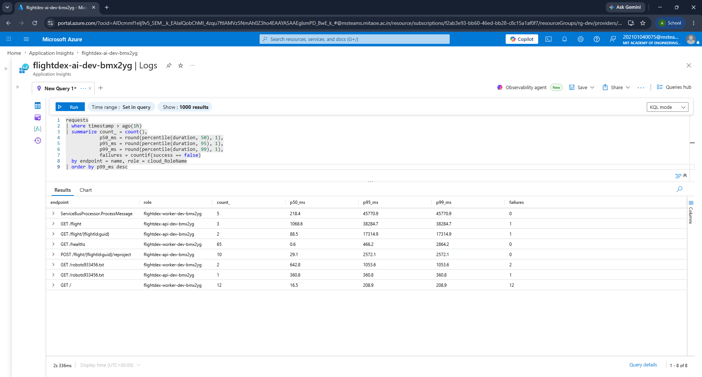
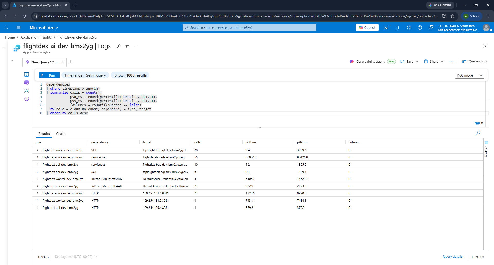
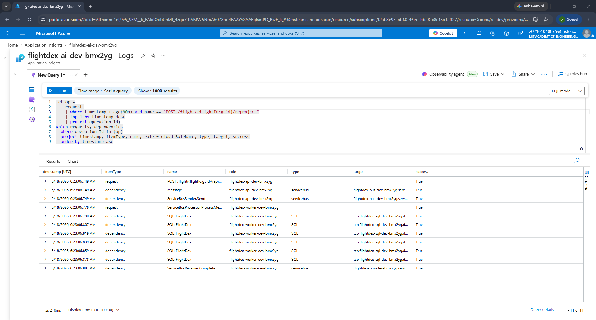
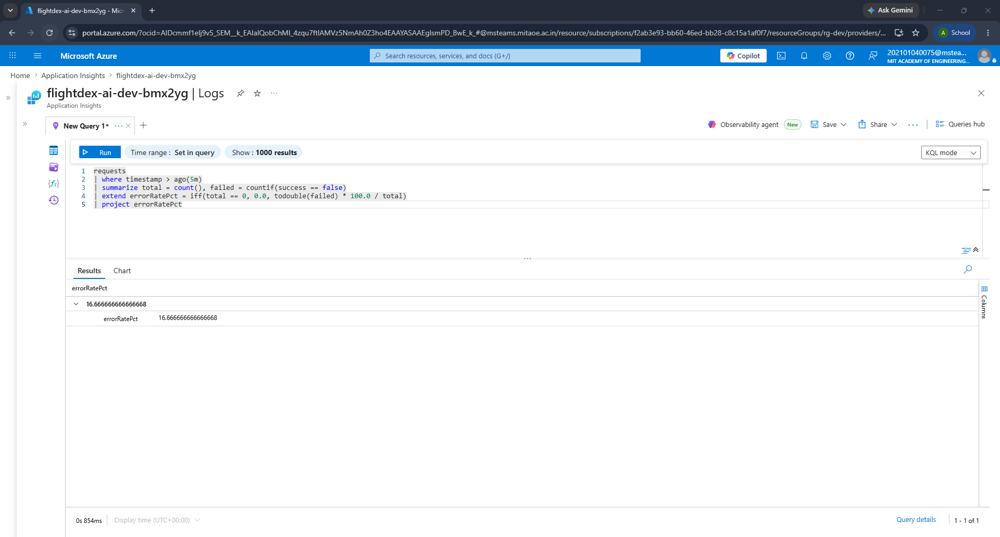
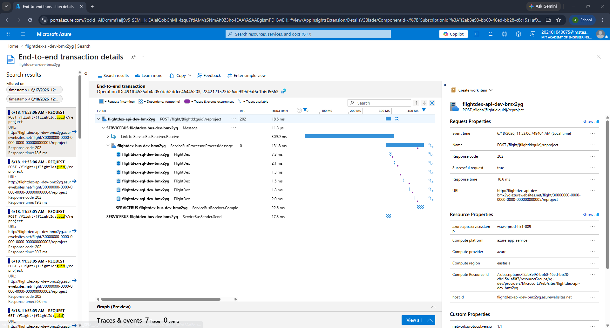
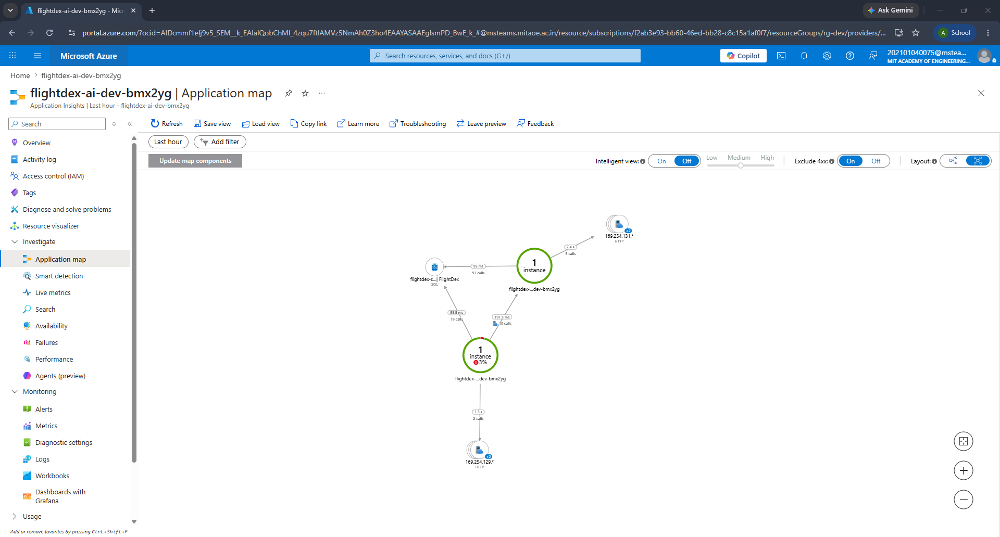

# Day 26 Part 1 — App Insights + KQL: Making Production Legible

Wired OpenTelemetry into both hosts and shipped it to a workspace-based Application Insights. To give a trace a second process to span, I added a real Service Bus **worker**: the API publishes a `FlightUpserted` event, the worker consumes it and rebuilds the `FlightView` read model in SQL. One distributed trace now stitches **API → Service Bus → worker → DB** under a single `operation_Id`, and the KQL below turns that telemetry into p50/p99 per endpoint, a dependency breakdown, and an error-rate alert. Everything here was provisioned, deployed, and verified live in `rg-dev`.

---

## 1. Wiring OpenTelemetry

### 1.1 The SDK in both hosts

Both hosts use the **Azure Monitor OpenTelemetry distro**, which auto-instruments ASP.NET Core, `HttpClient`, `SqlClient`, and the Azure SDK (Service Bus). It is only switched on when a connection string is present, so local runs stay telemetry-free (`Backend/src/Bootstrap/FlightDex.Api/Program.cs`).

```csharp
var aiConnectionString = builder.Configuration["APPLICATIONINSIGHTS_CONNECTION_STRING"];
if (!string.IsNullOrWhiteSpace(aiConnectionString))
{
    builder.Services.AddOpenTelemetry()
        .ConfigureResource(r => r.AddService("flightdex-api"))
        .UseAzureMonitor(o => o.ConnectionString = aiConnectionString);
}
```

The worker is identical except for the role name `flightdex-worker`. On App Service the distro resolves `cloud_RoleName` to the **site name** (`flightdex-api-dev-bmx2yg` / `flightdex-worker-dev-bmx2yg`), which is what separates the two roles in the trace and the Application Map.

### 1.2 Enabling Service Bus trace propagation

The distro does not, on its own, emit the Azure SDK messaging spans — without that, the worker's SQL calls landed as orphaned root traces with no link back to the API. The fix is one switch, set before any Azure client is created, in both `Program.cs` files. It makes the sender inject `traceparent` into the message and the processor continue that trace on the other side.

```csharp
AppContext.SetSwitch("Azure.Experimental.EnableActivitySource", true);
```

### 1.3 The App Insights resource (Bicep)

A workspace-based component over a capped Log Analytics workspace (`Infrastructure/modules/appInsights.bicep`). The connection string is injected into the API and worker as `APPLICATIONINSIGHTS_CONNECTION_STRING`; telemetry auth is the ingestion key inside that string, so no RBAC grant is needed.

```bicep
resource component 'Microsoft.Insights/components@2020-02-02' = {
  name: name
  kind: 'web'
  properties: {
    Application_Type:    'web'
    WorkspaceResourceId: workspace.id
    IngestionMode:       'LogAnalytics'
  }
}
output connectionString string = component.properties.ConnectionString
```

### 1.4 The trace path: API → worker → DB

A write endpoint publishes an event instead of doing the work inline; the publisher sends to Service Bus with managed identity, no SAS key (`FlightEndpoints.cs`, `ServiceBusEventBus.cs`).

```csharp
app.MapPost("/flight/{flightId:guid}/reproject", async (
    Guid flightId, [FromServices] IEventBus eventBus, CancellationToken ct) =>
{
    await eventBus.PublishAsync(new FlightUpsertedEvent(flightId, Guid.NewGuid(), DateTime.UtcNow), ct);
    return Results.Accepted();
});
```

A `BackgroundService` in the worker consumes the queue; the SDK starts a `ServiceBusProcessor.ProcessMessage` span that continues the API's trace, and the projection's EF Core calls become the SQL dependencies under it (`ServiceBusEventConsumer.cs`, `FlightViewProjectionService.cs`). RBAC stays least-privilege: the API is **Service Bus Data Sender + Key Vault Secrets User**, the worker is **Service Bus Data Receiver**, and the worker MI is mapped to a SQL contained user (`db_datareader`/`db_datawriter`).

---

## 2. KQL Queries

> Written against the Application Insights (classic) schema — run in the resource's **Logs** blade. On the workspace these are `AppRequests` / `AppDependencies` (columns `DurationMs`, `Name`, `Success`, `AppRoleName`).

### 2.1 p50 / p99 latency by endpoint

`name` is the route template, so this is per-endpoint, split by role.

```kql
requests
| where timestamp > ago(1h)
| summarize count_ = count(),
            p50_ms = round(percentile(duration, 50), 1),
            p95_ms = round(percentile(duration, 95), 1),
            p99_ms = round(percentile(duration, 99), 1),
            failures = countif(success == false)
  by endpoint = name, role = cloud_RoleName
| order by p99_ms desc
```

Each route template and role with its percentiles and failure count, ordered by p99.



### 2.2 Dependency call breakdown

Where each process spends its outbound time — SQL vs Service Bus, split by calling role. Live output showed the worker issuing the bulk of the SQL and both roles touching Service Bus.

```kql
dependencies
| where timestamp > ago(1h)
| summarize calls = count(),
            p50_ms = round(percentile(duration, 50), 1),
            p99_ms = round(percentile(duration, 99), 1),
            failures = countif(success == false)
  by role = cloud_RoleName, dependency = type, target
| order by calls desc
```

SQL and Service Bus calls grouped by role and target — the worker carries the bulk of the SQL, both roles touch Service Bus.



### 2.3 Confirming the distributed trace

Proves one `operation_Id` crosses both roles — the API request, the Service Bus publish, the worker's `ProcessMessage`, and its SQL writes.

```kql
let op =
    requests
    | where timestamp > ago(30m) and name == "POST /flight/{flightId:guid}/reproject"
    | top 1 by timestamp desc
    | project operation_Id;
union requests, dependencies
| where operation_Id in (op)
| project timestamp, itemType, name, role = cloud_RoleName, type, target, success
| order by timestamp asc
```

A single `operation_Id` listing the API request, the `Message` / `ServiceBusSender.Send` publish, the worker's `ServiceBusProcessor.ProcessMessage`, and the `SQL: FlightDex` writes — proof the trace crosses both roles.



### 2.4 Error-rate alert (log-based)

Failed-request percentage over the trailing 5 minutes.

```kql
requests
| where timestamp > ago(5m)
| summarize total = count(), failed = countif(success == false)
| extend errorRatePct = iff(total == 0, 0.0, todouble(failed) * 100.0 / total)
| project errorRatePct
```

A single `errorRatePct` value for the window (16.7% here, inflated by the deliberate 404s and cold-start probes from testing).



Wire that query into a scheduled-query alert that fires above 5%:

```bash
az monitor scheduled-query create -g rg-dev -n "flightdex-error-rate" \
  --scopes "$(az monitor app-insights component show -g rg-dev -a flightdex-ai-dev-bmx2yg --query id -o tsv)" \
  --condition "avg errorRatePct > 5" \
  --condition-query errorRatePct='requests | where timestamp > ago(5m) | summarize total=count(), failed=countif(success==false) | extend errorRatePct=iff(total==0,0.0,todouble(failed)*100.0/total) | project errorRatePct' \
  --evaluation-frequency 5m --window-size 5m --severity 2
```

---

## 3. Distributed Trace

A `reproject` call starts in the API, which opens the root request span and publishes a `FlightUpserted` message to Service Bus, injecting the `traceparent` into it. The worker — a separate process — picks the message off the queue and, instead of starting a fresh trace, continues the one carried in `traceparent`, so its `ServiceBusProcessor.ProcessMessage` span and the `SQL: FlightDex` writes beneath it hang off the same `operation_Id` as the API request. The result is one transaction whose spans cross two `cloud_RoleName`s — `flightdex-api-dev-bmx2yg` then `flightdex-worker-dev-bmx2yg` — stitching API → Service Bus → worker → DB end to end.

Observe in the end-to-end transaction how the top `POST /flight/{flightId}/reproject` (API) and the `ServiceBusSender.Send` publish are followed by the worker's `ServiceBusProcessor.ProcessMessage` and its nested `SQL: FlightDex` calls — all under a single operation.



Observe in the Application Map the two `flightdex-…-bmx2yg` instances (API and worker) as distinct nodes; because Service Bus is asynchronous it is not drawn as a connecting edge, so the two apps are joined in the picture through the shared `FlightDex` SQL database.


