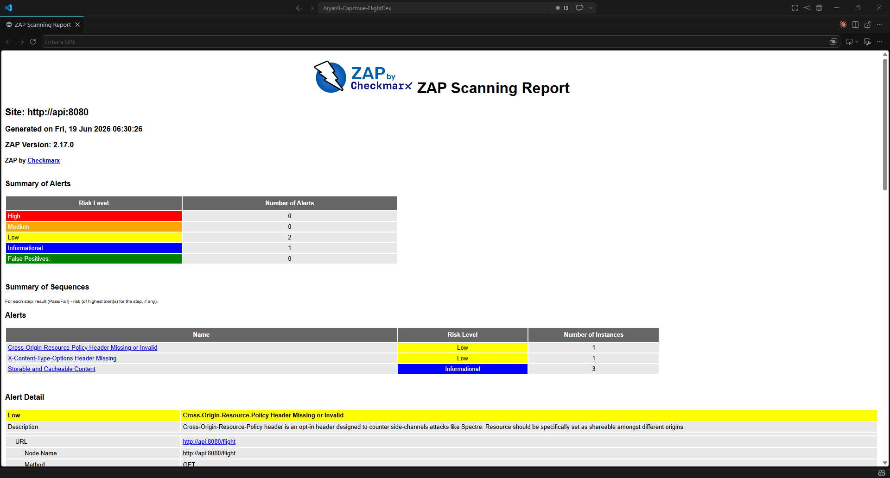
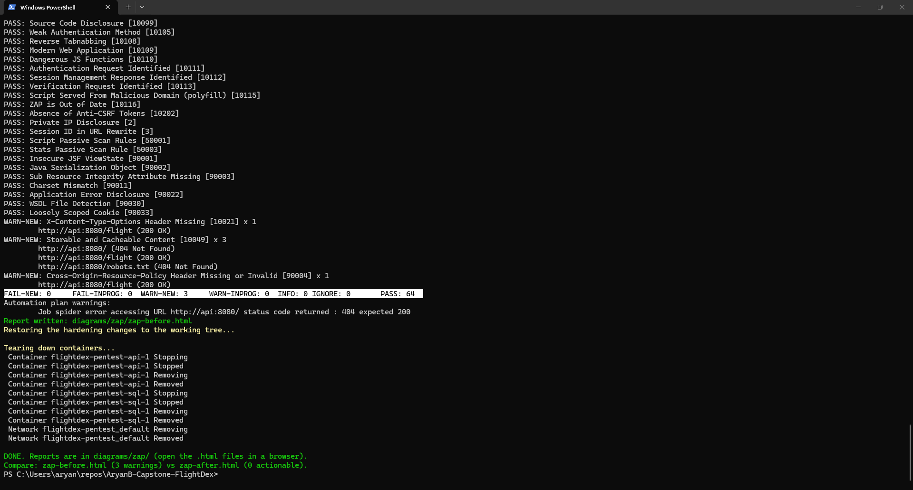
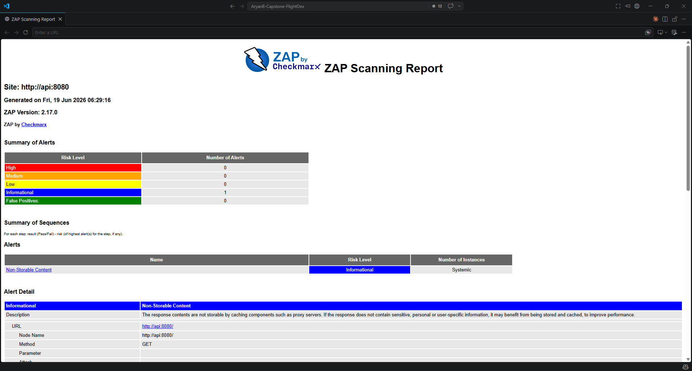
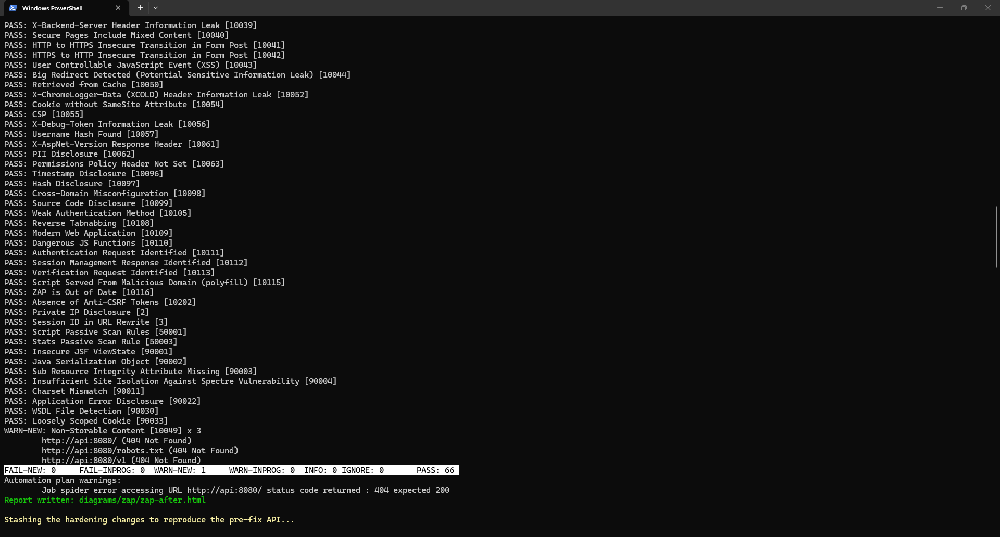

# Day 27 Piece 1 — Security Pass

Performed a security pass on the application: built a threat model, moved the data tier behind private endpoints, hardened the API, and ran a baseline penetration test before and after the fixes.

---

# 1. Threat Model

Listed the main threats using the STRIDE model and matched each one to the protection already in place or added here.

| STRIDE | Threat | Asset | Mitigation in FlightDex |
|--------|--------|-------|--------------------------|
| **S**poofing | Caller impersonates a user; a rogue process impersonates the app to SQL/Service Bus | API edge, data services | Entra ID **Easy Auth** at the edge (`unauthenticatedClientAction: Return401`); **managed identity** for SQL/SB/KV — no shared keys to steal; SQL is **Entra-only** (`azureADOnlyAuthentication`) |
| **T**ampering | Modify data in transit or at rest; tamper with queued messages | Request/response, SQL rows, SB messages | `httpsOnly` + `minTlsVersion 1.2` + **HSTS**; SQL `Encrypt=True`; **private endpoints** remove the public data path entirely; SB traffic over TLS with bounded redelivery |
| **R**epudiation | An action can't be traced back to a request | Audit trail | OpenTelemetry → App Insights with **one `operation_Id`** stitching API → Service Bus → worker → DB (Day 26) |
| **I**nformation Disclosure | Secret, data, or tech-stack leak | API key, flight data, server fingerprint | Key Vault **reference** (no plaintext secret in config); **private endpoints** (data not internet-reachable); `Server` header removed; **security headers**; `Production` env (no verbose errors) |
| **D**enial of Service | Resource exhaustion via huge or malformed requests | API + SQL | **`pageSize` clamp (≤ 100)**, **Kestrel body limit (64 KB)**; SB `maxDeliveryCount: 10` + dead-letter to bound retry storms |
| **E**levation of Privilege | A component gains rights beyond its role | RBAC assignments | **Least-privilege split** — API = *SB Data Sender* + *KV Secrets User*; worker = *SB Data Receiver*; each MI is a SQL contained user (`db_datareader`/`db_datawriter`), not admin; SB `disableLocalAuth: true` |

Two gaps remain open: there is no request rate limiting yet, and the messaging service is still reachable over the public internet (locking it down needs a higher pricing tier).

---

# 2. Private Endpoint Change

Built a private network so the database and secrets store are no longer open to the public internet — they are now reached only from inside that network.

Added the private network: one network with separate areas for the data services and for the apps.

```bicep
resource vnet 'Microsoft.Network/virtualNetworks@2023-09-01' = {
  name: vnetName
  properties: {
    addressSpace: { addressPrefixes: ['10.20.0.0/16'] }
    subnets: [
      { name: 'snet-data',   properties: { addressPrefix: '10.20.0.0/24', privateEndpointNetworkPolicies: 'Disabled' } }
      { name: 'snet-app',    properties: { addressPrefix: '10.20.1.0/24', delegations: [ { name: 'webapp', properties: { serviceName: 'Microsoft.Web/serverFarms' } } ] } }
      { name: 'snet-worker', properties: { addressPrefix: '10.20.2.0/24', delegations: [ { name: 'webapp', properties: { serviceName: 'Microsoft.Web/serverFarms' } } ] } }
    ]
  }
}
// privatelink<sqlServerHostname> + privatelink.vaultcore.azure.net, each linked to the VNet
```

Added a private endpoint for each data service inside the network.

```bicep
resource sqlPe 'Microsoft.Network/privateEndpoints@2023-09-01' = {
  name: 'pe-sql'
  properties: {
    subnet: { id: dataSubnetId }
    privateLinkServiceConnections: [ { name: 'sql', properties: { privateLinkServiceId: sqlServerId, groupIds: ['sqlServer'] } } ]
  }
}
// kvPe is identical with groupIds: ['vault']; each gets a privateDnsZoneGroups/default child
```

Turned off public access on the data services.

```bicep
// sql.bicep
publicNetworkAccess: publicNetworkAccess   // 'Disabled' by default now
resource allowAzureServices '...firewallRules@...' = if (publicNetworkAccess == 'Enabled') { ... }

// keyVault.bicep
publicNetworkAccess: publicNetworkAccess
networkAcls: { defaultAction: publicNetworkAccess == 'Disabled' ? 'Deny' : 'Allow', bypass: 'AzureServices' }
```

Connected the apps to the private network so they reach the data services privately.

```bicep
virtualNetworkSubnetId: empty(vnetIntegrationSubnetId) ? null : vnetIntegrationSubnetId
siteConfig: { vnetRouteAllEnabled: !empty(vnetIntegrationSubnetId), ... }
```

Wired everything together in the main template. It compiles cleanly.

> Note: with public access off, any database admin step now has to be run from inside the private network rather than from a laptop.

---

# 3. ZAP Test — Before Fix

Performed a baseline penetration test (OWASP ZAP) against the API before the fixes. Everything ran in containers, so nothing was installed on the machine.

## 3.1 Results

Results returned a few low-risk issues.

| FAIL | WARN | INFO | IGNORE | PASS |
|------|------|------|--------|------|
| 0 | 3 | 0 | 0 | 64 |

| Alert | Risk | Instances | Description |
|-------|------|-----------|-------------|
| X-Content-Type-Options Header Missing `[10021]` | Low | 1 | Response is missing the `nosniff` header, so a browser may guess the content type. |
| Cross-Origin-Resource-Policy Header Missing or Invalid `[90004]` | Low | 1 | Response is missing the header that blocks cross-origin side-channel access. |
| Storable and Cacheable Content `[10049]` | Informational | 3 | Responses can be stored by shared caches. |

## 3.2 Screenshots

ZAP report (before) — `High 0 / Medium 0 / Low 2 / Informational 1`:



Terminal output of the scan:



---

# 4. Fix

Hardened the API: added versioning, limited input sizes, and added security headers.

Limited the page size so a single request can't ask for too much.

```csharp
public const int MaxPageSize = 100;
public PagedRequest(int pageNumber = 1, int pageSize = DefaultPageSize)
{
    PageNumber = pageNumber < 1 ? 1 : pageNumber;
    PageSize   = pageSize switch { < 1 => DefaultPageSize, > MaxPageSize => MaxPageSize, _ => pageSize };
}
```

Capped the request size and stopped the server from advertising its name.

```csharp
builder.WebHost.ConfigureKestrel(options =>
{
    options.AddServerHeader = false;               // no "Server: Kestrel"
    options.Limits.MaxRequestBodySize = 64 * 1024; // 64 KB
});
```

Put every route under a version prefix so the API can change later without breaking callers.

```csharp
var v1 = app.MapGroup("/v1");
v1.MapGet("/flight", …);  v1.MapGet("/flight/{flightId:guid}", …);  v1.MapPost("/flight/{flightId:guid}/reproject", …);
```

Added security headers to every response.

```csharp
app.Use(async (context, next) =>
{
    var headers = context.Response.Headers;
    headers["X-Content-Type-Options"]       = "nosniff";
    headers["X-Frame-Options"]               = "DENY";
    headers["Content-Security-Policy"]       = "default-src 'none'; frame-ancestors 'none'";
    headers["Referrer-Policy"]               = "no-referrer";
    headers["Strict-Transport-Security"]     = "max-age=31536000; includeSubDomains";
    headers["Cross-Origin-Resource-Policy"]  = "same-origin";
    headers["Cache-Control"]                 = "no-store";
    await next();
});
```

Checked it live — results returned as expected:

```
GET /v1/flight?pageSize=99999  → response "pageSize":100   (clamped)
GET /v1/flight?pageSize=-5     → response "pageSize":20    (default)
GET /flight                    → 404  (only /v1 is routed)
Response headers: X-Content-Type-Options, X-Frame-Options, CSP, Referrer-Policy, HSTS,
                  Cross-Origin-Resource-Policy present; no Server header.
```

---

# 5. ZAP Test — After Fix

Re-ran the same baseline penetration test against the hardened API.

## 5.1 Results

Results returned clean (before: WARN 3 / PASS 64). The one remaining item is just a note that responses are no longer cached, which is what we wanted.

| FAIL | WARN | INFO | IGNORE | PASS |
|------|------|------|--------|------|
| 0 | 1 | 0 | 0 | 66 |

| Alert | Risk | Instances | Description |
|-------|------|-----------|-------------|
| Non-Storable Content `[10049]` | Informational | 3 | Responses are marked `no-store` and no longer cached — the intended result of the fix. |

## 5.2 Screenshots

ZAP report (after) — `High 0 / Medium 0 / Low 0 / Informational 1`:



Terminal output of the scan:


