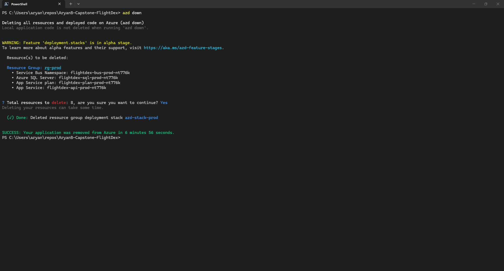
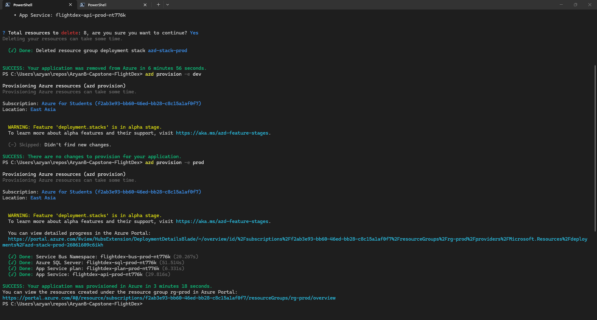
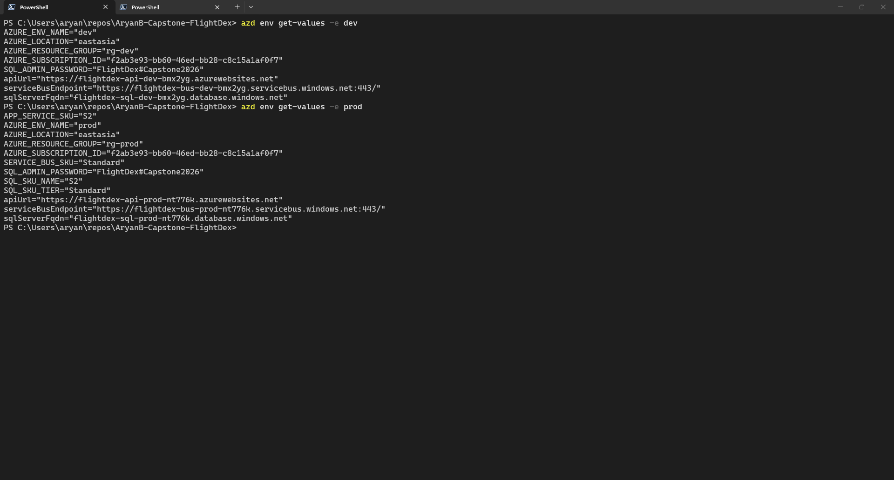
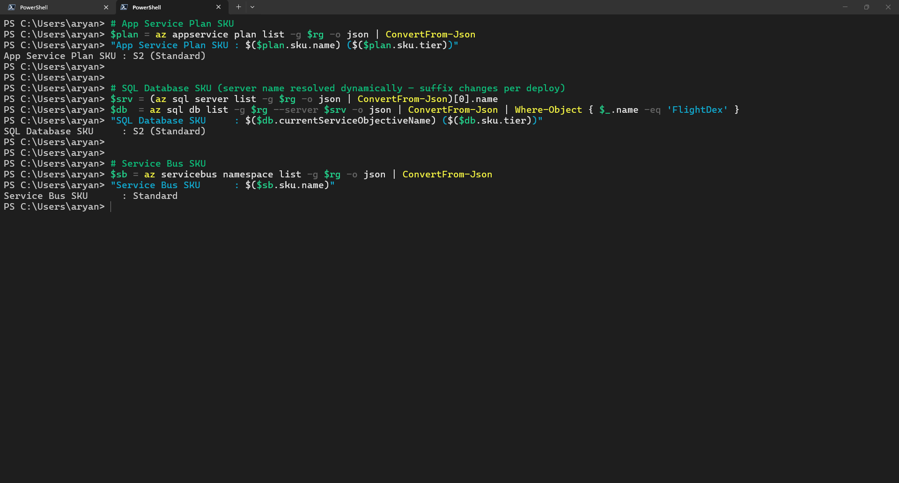
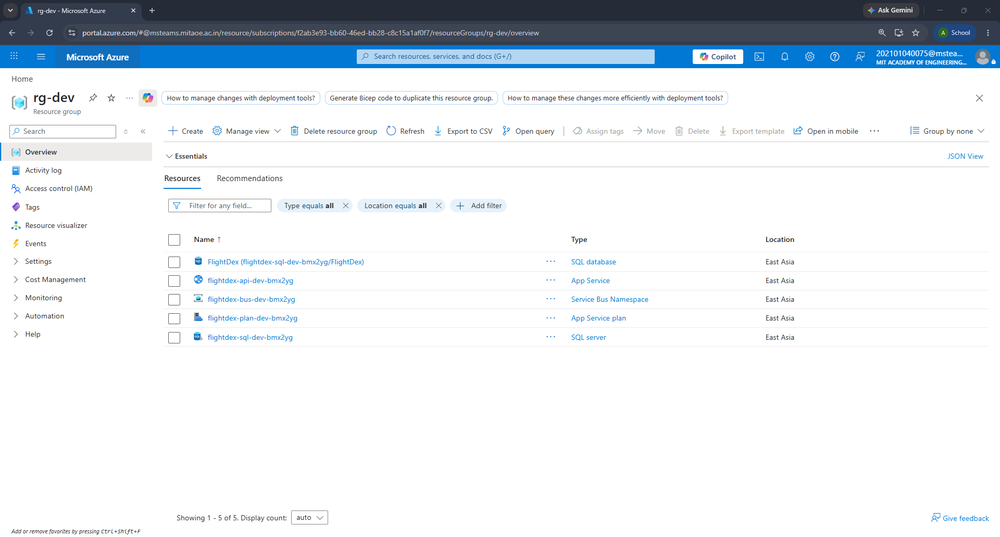
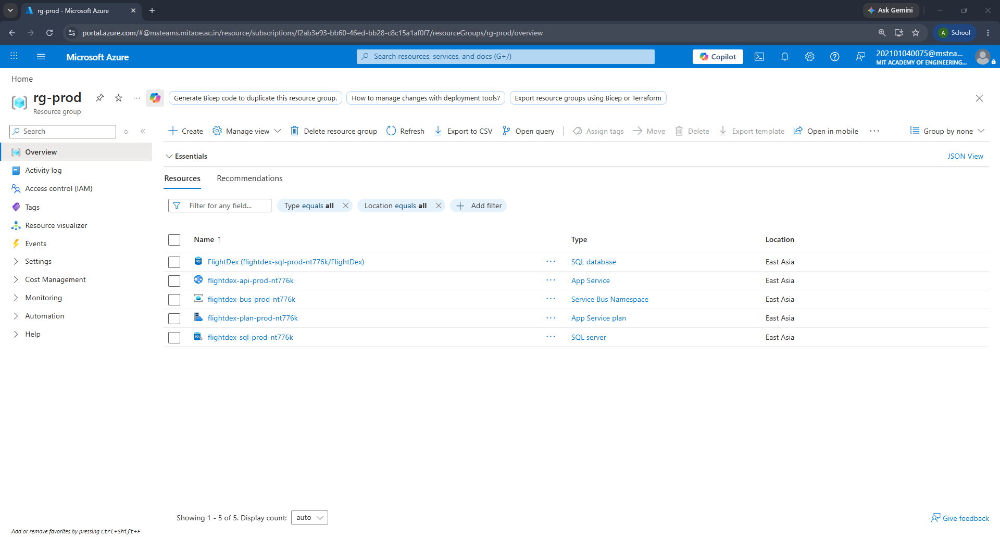

# Day 24 Part 1 - Deployment via Deployment Stacks + azd Day 24 Part 1

Deployed using Deployment stack through azd. Ran a clean teardown and re deployment.
---

## 1. azd config

Deployment Stacks are an alpha feature in azd — enabled once per machine:

### 1.1 Turning Deployment stacks on

```pwsh
azd config set alpha.deployment.stacks on
```

### 1.2 azure.yaml

```yaml
# azd project manifest — drives provisioning of the FlightDex stack.
# Provisioning uses Azure Deployment Stacks (azd alpha: deployment.stacks),
# so the whole stack is one managed unit: clean teardown + drift detection.
name: flightdex
metadata:
  template: flightdex@1.0.0

# main.bicep is resourceGroup-scoped. azd targets the RG named by the
# AZURE_RESOURCE_GROUP env var, defaulting to "rg-<env>" (rg-dev, rg-prod),
# and creates it if it doesn't already exist.

infra:
  provider: bicep
  path: Infrastructure
  module: main
```

### 1.3 Infrastructure/main.parameters.json

azd does not consume `.bicepparam` files — it binds the Bicep parameters through a
`main.parameters.json` using `${VAR}` substitution (with `${VAR=default}` defaults).
dev rides the defaults; prod overrides the four SKU vars via `azd env set`.

```json
{
  "$schema": "https://schema.management.azure.com/schemas/2019-04-01/deploymentParameters.json#",
  "contentVersion": "1.0.0.0",
  "parameters": {
    "environmentName":   { "value": "${AZURE_ENV_NAME}" },
    "location":          { "value": "${AZURE_LOCATION}" },
    "sqlAdminUsername":  { "value": "${SQL_ADMIN_USERNAME=flightdexadmin}" },
    "sqlAdminPassword":  { "value": "${SQL_ADMIN_PASSWORD}" },
    "appServiceSkuName": { "value": "${APP_SERVICE_SKU=B1}" },
    "sqlSkuName":        { "value": "${SQL_SKU_NAME=Basic}" },
    "sqlSkuTier":        { "value": "${SQL_SKU_TIER=Basic}" },
    "serviceBusSkuName": { "value": "${SERVICE_BUS_SKU=Basic}" }
  }
}
```

### 1.4 azd env
Per-environment values (secrets live in `.azure/<env>/.env`, git-ignored):

```pwsh
# dev — rides the B1 / Basic / Basic defaults
azd env new dev  --subscription <sub-id> --location eastasia
azd env set SQL_ADMIN_PASSWORD "<password>" -e dev

# prod — promote SKUs
azd env new prod --subscription <sub-id> --location eastasia
azd env set SQL_ADMIN_PASSWORD "<password>" -e prod
azd env set APP_SERVICE_SKU "S2"       -e prod
azd env set SQL_SKU_NAME    "S2"       -e prod
azd env set SQL_SKU_TIER    "Standard" -e prod
azd env set SERVICE_BUS_SKU "Standard" -e prod
```

---

## 2. Deploy output
First did a teardown and deployed using azd provision to dev and prod. This was done to test the convinience of instant deployment, re-deployment and teardown.

### 2.1 Teardown
```pwsh
azd down
```
```pwsh
Deleting all resources and deployed code on Azure (azd down)
Local application code is not deleted when running 'azd down'.


WARNING: Feature 'deployment.stacks' is in alpha stage.
To learn more about alpha features and their support, visit https://aka.ms/azd-feature-stages.

  Resource(s) to be deleted:

  Resource Group: rg-prod
    • Service Bus Namespace: flightdex-bus-prod-nt776k
    • Azure SQL Server: flightdex-sql-prod-nt776k
    • App Service plan: flightdex-plan-prod-nt776k
    • App Service: flightdex-api-prod-nt776k


? Total resources to delete: 8, are you sure you want to continue? Yes
Deleting your resources can take some time.

  (✓) Done: Deleted resource group deployment stack azd-stack-prod


SUCCESS: Your application was removed from Azure in 6 minutes 56 seconds.
```

### 2.2 dev

Dev was already live from the initial deploy, so this re-run shows the stack comparing
state, finding no drift, and applying nothing — the idempotency a stack-backed provision gives:

```pwsh
azd provision -e dev
```
```pwsh
Provisioning Azure resources (azd provision)
Provisioning Azure resources can take some time.

Subscription: Azure for Students (f2ab3e93-bb60-46ed-bb28-c8c15a1af0f7)
Location: East Asia

  WARNING: Feature 'deployment.stacks' is in alpha stage.
  To learn more about alpha features and their support, visit https://aka.ms/azd-feature-stages.

  (-) Skipped: Didn't find new changes.

SUCCESS: There are no changes to provision for your application.
```

#### azd env values
```pwsh
azd env get-values -e dev
```
```pwsh
apiUrl             = https://flightdex-api-dev-bmx2yg.azurewebsites.net
sqlServerFqdn      = flightdex-sql-dev-bmx2yg.database.windows.net
serviceBusEndpoint = https://flightdex-bus-dev-bmx2yg.servicebus.windows.net:443/
```

### 2.3 prod

Same `main.bicep` and `main.parameters.json`. Only the four SKU env vars differ.

#### azd provision
```pwsh
azd provision -e prod
```
```pwsh
Provisioning Azure resources (azd provision)
Provisioning Azure resources can take some time.

Subscription: Azure for Students (f2ab3e93-bb60-46ed-bb28-c8c15a1af0f7)
Location: East Asia

  WARNING: Feature 'deployment.stacks' is in alpha stage.
  To learn more about alpha features and their support, visit https://aka.ms/azd-feature-stages.

  You can view detailed progress in the Azure Portal:
  https://portal.azure.com/#view/HubsExtension/DeploymentDetailsBlade/~/overview/id/.../azd-stack-prod-26061609c6ikh

  (✓) Done: Service Bus Namespace: flightdex-bus-prod-nt776k (20.267s)
  (✓) Done: Azure SQL Server: flightdex-sql-prod-nt776k (51.514s)
  (✓) Done: App Service plan: flightdex-plan-prod-nt776k (6.331s)
  (✓) Done: App Service: flightdex-api-prod-nt776k (29.816s)

SUCCESS: Your application was provisioned in Azure in 3 minutes 18 seconds.
You can view the resources created under the resource group rg-prod in Azure Portal:
https://portal.azure.com/#@/resource/subscriptions/.../resourceGroups/rg-prod/overview
```

#### azd env values 
```pwsh
azd env get-values -e prod
```
```pwsh
apiUrl             = https://flightdex-api-prod-nt776k.azurewebsites.net
sqlServerFqdn      = flightdex-sql-prod-nt776k.database.windows.net
serviceBusEndpoint = https://flightdex-bus-prod-nt776k.servicebus.windows.net:443/
```

### 2.4 Comfirming Promotion
Reading the SKUs back off the live prod resources proves the S2 / Standard overrides took effect (run against `rg-prod`):

#### App Service Plan
```pwsh
$rg = 'rg-prod'
$plan = az appservice plan list -g $rg -o json | ConvertFrom-Json
"App Service Plan SKU : $($plan.sku.name) ($($plan.sku.tier))"
```
```pwsh
App Service Plan SKU : S2 (Standard)
```
#### SQL Database SKU
```pwsh
$srv = (az sql server list -g $rg -o json | ConvertFrom-Json)[0].name
$db  = az sql db list -g $rg --server $srv -o json | ConvertFrom-Json | Where-Object { $_.name -eq 'FlightDex' }
"SQL Database SKU     : $($db.currentServiceObjectiveName) ($($db.sku.tier))"
```
```pwsh
SQL Database SKU     : S2 (Standard)
```
#### Service Bus SKU
```pwsh
$sb = az servicebus namespace list -g $rg -o json | ConvertFrom-Json
"Service Bus SKU      : $($sb.sku.name)"
```
```pwsh
Service Bus SKU      : Standard
```
---

## 3. Output Screenshots

### 3.1 az down


### 3.2 az provision dev and prod


### 3.3 azd env


### 3.4 az resource groups


### 3.5 Resource Group Dev


### 3.6 Resource Group Prod


## 4. What Deployment Stacks give over plain deployments

With Deployment Stacks, tearing the entire environment down in one command can be done, while a plain deployment could have required hunting down and deleting every resource by hand. A deploymet stacks also detects drift from any out-of-band change, while a plain deployment could have required spotting that change yourself long after it slipped in.
