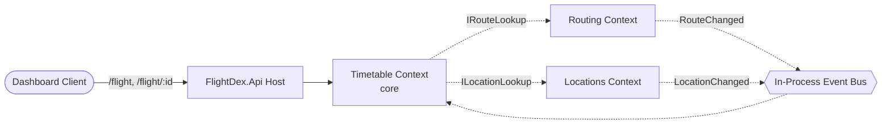
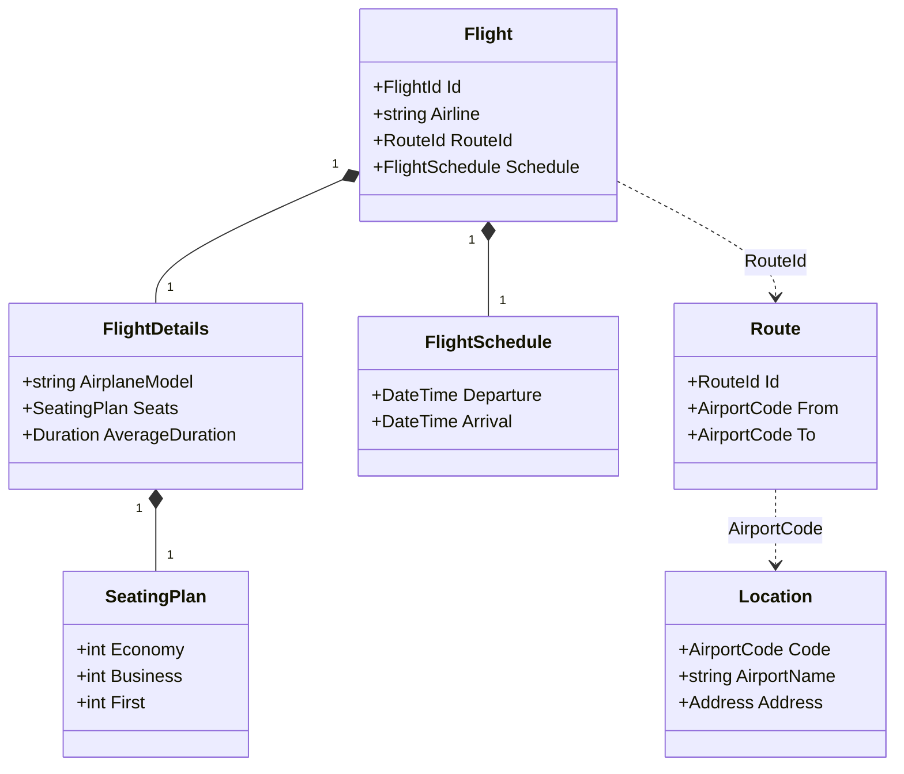
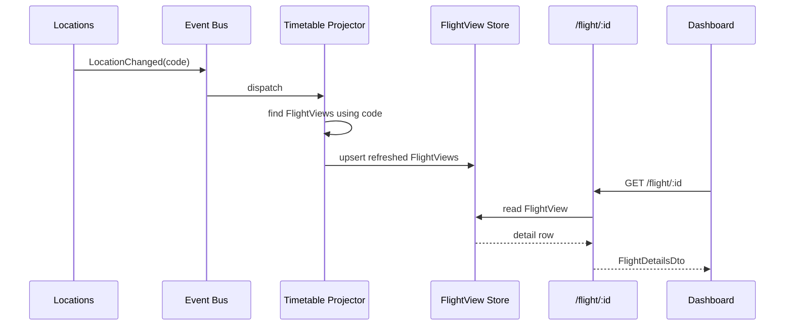

### Current Slice
The current product slice taken for this task is the main timetable page. It displays in a paginated manner a timtetable of flights filtered or sorted by departure location, arrival location, location, airport and time. It can be used to view all flights by time or departing at your nearest airport. The current slice does not have users. They will be added later on and the currently assigned flight data will be allocated to the new seeded airline-admins.

Planed Slices for the full project:
- Slice 1- Timetable
- Slice 2- User Management and Tracked Flights
- Slice 3- Future feature updates

## Design

## 1 Contexts

Timetable is the core context and the only one the dashboard talks to. Routing and Locations are supporting contexts that Timetable reads from to enrich a flight into a full detail view. Contexts never share tables; they exchange data through application-layer contracts and integration events.

```text
Dashboard
   |
   |  GET /flight , /flight/{flightId}
   v
FlightDex.Api  (single host)
   |
   v
Timetable (core) --IRouteLookup-----> Routing     (supporting)
   ^             --ILocationLookup---> Locations   (supporting)
   |
   |  dispatch
In-Process Event Bus <--RouteChanged------ Routing
                     <--LocationChanged---- Locations
```

- **Timetable** (core) — owns `Flight` + `FlightDetails`; serves the dashboard; builds the denormalized `FlightView` read model.
- **Routing** (supporting) — owns `Route`; resolves `RouteID` → from/to airport codes.
- **Locations** (supporting) — owns `Location`; resolves airport code → airport name + city/state/country.
- Dependency direction: `Timetable → Routing`, `Timetable → Locations` (read-only, via ports).
- No shared persistence; one schema per context, one host process.



## 2 Aggregates

`Flight` is the core aggregate root; `FlightDetails` is an entity inside its boundary, never loaded independently. `Route` and `Location` are independent aggregate roots in their own contexts, referenced only by identity (`RouteId`, `AirportCode`). `FlightView` is a denormalized read model, not an aggregate.

```text
Flight  (aggregate root)
  |-- FlightId
  |-- Airline
  |-- FlightSchedule (VO) -- Departure, Arrival
  |-- RouteId ............> Route  (root, Routing ctx)
  |                          |-- From: AirportCode ....> Location (root, Locations ctx)
  |                          '-- To:   AirportCode ....> Location
  '-- FlightDetails (entity)
        |-- AirplaneModel
        |-- SeatingPlan (VO) -- Economy, Business, First
        '-- AverageDuration

FlightView (read model) = flattened  Flight + Route + Location

  ....>  = reference by identity across a context boundary
```

- **Flight** (root) — `FlightId`, `Airline`, `RouteId`, `FlightSchedule` (departure/arrival), `FlightDetails`.
- **FlightDetails** (entity) — airplane model, `SeatingPlan` (economy/business/first), average duration.
- **FlightSchedule** (VO) — departure/arrival timestamps; derives duration.
- **SeatingPlan** (VO) — seat counts by class.
- **Route** (root) — `RouteId`, from `AirportCode`, to `AirportCode`.
- **Location** (root) — `AirportCode`, airport name, `Address` (city/state/country).
- **FlightView** (read model) — flattened flight + route + location fields for the detail panel.



## 3 — Async Flows

Detail reads are served from the `FlightView` read model so the dashboard never fans out to other contexts at request time. The view is kept fresh asynchronously: when a flight, route, or location changes, the owning context publishes an integration event to the in-process bus, and the Timetable projector rebuilds the affected `FlightView` rows.

```text
WRITE / refresh (async)
  Routing   --RouteChanged----+
                              +--> Event Bus --> Timetable Projector --> FlightView store
  Locations --LocationChanged-+                        |
                                                       |  pulls route + location
                                                       v       via ports
                                              Routing + Locations

READ (sync)
  Dashboard --GET /flight/{id}--> API --> FlightView store --> FlightDetailsDto
```

- **Query path** (sync) — `/flight/{id}` reads `FlightView` directly; no cross-context call.
- **FlightUpserted** — Timetable projects a new/updated `FlightView`, pulling route + location data via ports.
- **RouteChanged** — Routing publishes; Timetable refreshes views referencing that `RouteId`.
- **LocationChanged** — Locations publishes; Timetable refreshes views referencing that `AirportCode`.
- Bus is in-process (modular monolith); handlers run in the same host, swappable for a broker later.

