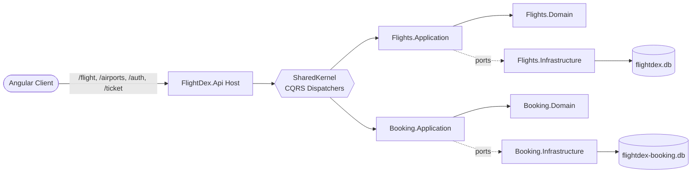
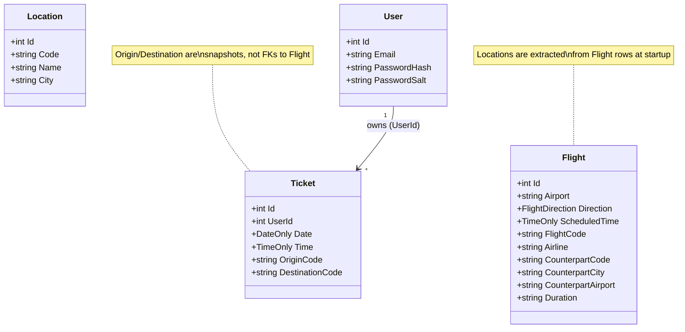
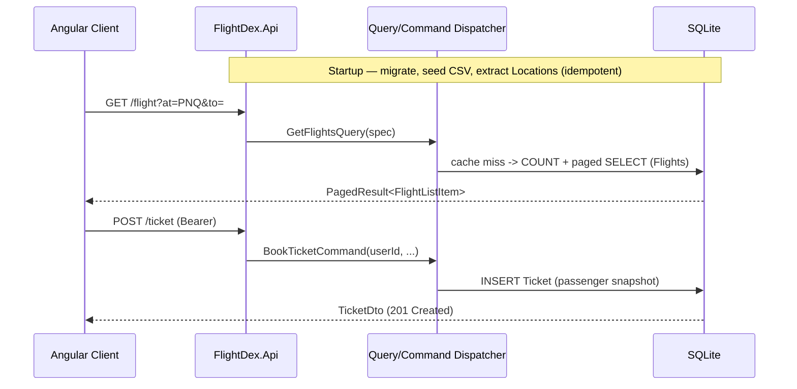

## Design

FlightDex is a modular monolith: one ASP.NET Core host (`FlightDex.Api`) composes two
independent vertical-slice modules — **Flights** (a read-only airport timetable) and
**Booking** (accounts, auth and tickets) — over a small **SharedKernel** (CQRS dispatchers
and paging). Each module follows the onion/Clean layering Domain → Application →
Infrastructure; the API host is the only composition root. The modules share no tables and
exchange no events — they meet only at the HTTP surface and in the browser.

## 1 Modules

The host wires four projects per module group: the Api host, the SharedKernel, and the
Domain/Application/Infrastructure trio for each of Flights and Booking. Controllers depend
only on the SharedKernel's `IQueryDispatcher` / `ICommandDispatcher`; the dispatcher resolves
the right per-module handler. Each module owns its own SQLite database file — there is no
shared persistence and no cross-module foreign key.

```text
Browser (Angular)
   |
   |  /flight /airports        /auth /ticket
   v                              v
FlightDex.Api  (single host, composition root)
   |  AddCqrs + AddFlights* + AddBooking*
   |
   |--IQueryDispatcher / ICommandDispatcher--> (SharedKernel: resolves handlers)
   |
   +--> Flights module  (Domain/Application/Infrastructure)  --> flightdex.db
   |        read-only timetable + airport suggestions
   |
   +--> Booking module  (Domain/Application/Infrastructure)  --> flightdex-booking.db
            users, JWT auth, tickets

No shared tables. No integration events. JWT bearer guards /ticket only.
```

- **FlightDex.Api** (host) — controllers, request DTOs, JWT bearer setup, CORS, and the
  startup pipeline (migrate → seed → extract). The composition root; references both modules.
- **FlightDex.SharedKernel** — the CQRS contracts (`ICommand<T>`, `IQuery<T>`, their handlers)
  and dispatchers, plus the generic `PagedResult<T>`. No domain logic.
- **Flights** (`.Domain` / `.Application` / `.Infrastructure`) — owns the timetable. Domain:
  `Flight`, `Location`. Application: `GetFlights`, `GetFlightByCode`. Infrastructure:
  EF Core over SQLite, the CSV seeder, the Locations extract, and `IMemoryCache` page caching.
- **Booking** (`.Domain` / `.Application` / `.Infrastructure`) — owns accounts and tickets.
  Domain: `User`, `Ticket`. Application: `RegisterUser`, `Login`, `BookTicket`, `CancelTicket`,
  `GetMyTickets`. Infrastructure: EF Core over SQLite, PBKDF2 hashing, JWT issuance.
- Dependency direction within each module: `Api → Application → Domain`, with
  `Infrastructure` implementing the Application's ports. Modules never reference each other.



## 2 Aggregates

Flights has two aggregates and Booking has two; none reference each other by identity.
`Flight` is a single denormalized timetable row that unifies departures and arrivals — a
`Direction` flag says which, and the `Counterpart*` fields describe the *other* end of the
leg (the destination for a departure, the origin for an arrival). `Location` is a derived
lookup row for type-ahead. In Booking, `Ticket` is owned by a `User`, but the airport and
passenger details are **snapshotted** onto the ticket at booking time, so it stays a faithful
record even if the user later edits their profile.

```text
Flights module
  Flight  (one row per leg; unifies departures + arrivals)
    |-- Airport            served end: BLR | BOM | PNQ | LON | DBX
    |-- Direction          Departure | Arrival
    |-- ScheduledTime      departure time, or arrival time
    |-- Airline, AirlineCode, FlightCode, Duration ("1h 35m")
    '-- Counterpart{ Airport, Code, City }   the other end of the leg
  Location  (derived; one per distinct counterpart airport)
    '-- Code, Name, City    powers /airports/suggestions

Booking module
  User  (account)
    |-- Email, FirstName, LastName, Age, flags
    '-- PasswordHash + PasswordSalt   (PBKDF2; password never stored)
  Ticket  (owned by User.Id)
    |-- Date, Time
    |-- Origin{ Code, Airport, City }        snapshot
    |-- Destination{ Code, Airport, City }   snapshot
    '-- FirstName, LastName, Age              snapshot from the user's profile
```

- **Flight** (root) — the unified timetable row; queried by direction, served airport,
  counterpart term (code / city / name), flight code and time window.
- **Location** (root) — a `(Code, Name, City)` triple rebuilt from the timetable's distinct
  counterpart airports at startup; read-only thereafter.
- **User** (root) — authenticates with email + PBKDF2 hash/salt; name + age feed each ticket.
- **Ticket** (root) — owned by a `User`; origin/destination and passenger fields are copies,
  not references — Booking holds no link to the Flights timetable.



## 3 — Flows

There is no event bus or background projection — every request is synchronous
request/response. The one piece of deferred work is startup: each module's EF Core
migrations are applied, the Flights timetable is seeded from the bundled CSV exports, and
the `Locations` lookup table is extracted from the seeded rows. All three steps are
idempotent, so a warm database skips straight to serving. At request time, reads hit SQLite
(with an in-memory page cache in front of the timetable) and writes go through the
authenticated Booking handlers.

```text
STARTUP (once, idempotent)
  MigrateAsync(Flights) ; MigrateAsync(Booking)
        |
        v
  Seed Flights from CSV  --(distinct counterpart airports)-->  Build Locations table

READ (sync, public)
  Browser --GET /flight?at&to|from&...--> FlightController --> GetFlightsQuery
        --> FlightRepository (IMemoryCache -> SQLite) --> PagedResult<FlightListItem>
  Browser --GET /flight/{code}---------> GetFlightByCodeQuery --> FlightDetail
  Browser --GET /airports/suggestions--> AirportController --> Locations table

WRITE (sync, JWT bearer required for /ticket)
  Browser --POST /auth/register|login--> AuthController --> Register/Login command --> JWT
  Browser --POST /ticket (Bearer)------> TicketController --> BookTicketCommand --> INSERT
  Browser --DELETE /ticket/{id} (Bearer)--> CancelTicketCommand --> DELETE if owned
```

- **Startup seed + extract** — `FlightTimetableSeeder` loads `Departures_*`/`Arrivals_*` CSVs;
  `AirportSuggestionCacheBuilder` writes one `Location` per distinct counterpart airport. Both
  no-op if their table already has rows.
- **Timetable read** (sync, public) — `GetFlightsQuery` → `FlightRepository.GetPagedAsync`,
  which serves repeat (filter + page) requests from `IMemoryCache` and otherwise runs a
  `COUNT(*)` + paged `SELECT` over `Flights`.
- **Detail / suggestions** (sync, public) — `/flight/{code}` returns the leg(s) for a code;
  `/airports/suggestions` reads the small `Locations` table, never the full timetable.
- **Auth + tickets** (sync) — register/login issue a JWT (`JwtTokenService`, PBKDF2 verify);
  `/ticket` is `[Authorize]`, and every command scopes to `User.GetUserId()` so a user only
  ever touches their own tickets.


