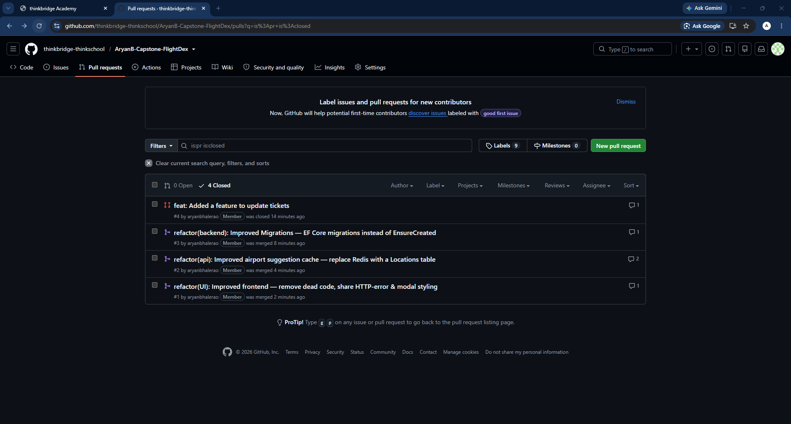

# Day 30 Piece 1 - feature completeness

Use Claude's code review agent to perform code-review. Also, asked claude to add a missing feature if required. Created PR Requests for these. After considering everything, accepted and rejected some PRs with proper reasons documented in threads.

## PR Links: 

### All PRs: https://github.com/thinkbridge-thinkschool/AryanB-Capstone-FlightDex/pulls?q=is%3Apr+is%3Aclosed
### Snapshot


## PR #1: https://github.com/thinkbridge-thinkschool/AryanB-Capstone-FlightDex/pull/1
## PR #2: https://github.com/thinkbridge-thinkschool/AryanB-Capstone-FlightDex/pull/2
## PR #3: https://github.com/thinkbridge-thinkschool/AryanB-Capstone-FlightDex/pull/3
## PR #4: https://github.com/thinkbridge-thinkschool/AryanB-Capstone-FlightDex/pull/4

## My Actions:
PR | Action | Reason
---|---|---
PR #1 refactor(UI): Improved frontend — remove dead code, share HTTP-error & modal styling | Accepted | A lot of dead code was removed and improvements were usefull. 
PR #2 refactor(api): Improved airport suggestion cache — replace Redis with a Locations table | Accepted | Redis on Azure costs a lot. A smaller schema was a acceptable solution.
PR #3 refactor(backend): Improved Migrations — EF Core migrations instead of EnsureCreated | Accepted | This is a great fix and required improvement. EF Core Migrations are better than EnsureCreatedAsync().
PR #4 feat: Added a feature to update tickets | Rejected | The code and implementation is working and correct. Although I am rejecting this PR, since this is not a required feature. Usually the user will cancel his last flight's ticket and then book a new one. Mostly such a feature is not provided by any major Airlines or Flight Ticket Booking Websites.

## PR Threads

### Accepted PR - PR #2 Thread

Link: https://github.com/thinkbridge-thinkschool/AryanB-Capstone-FlightDex/pull/2

```txt
aryanbhalerao
commented
48 minutes ago
Member
Summary
Removes the Redis dependency for airport type-ahead suggestions and makes them a normal SQLite Locations table, owned by FlightsDbContext like the other tables. One fewer moving part to run, no external cache to provision.

Changes
New Location entity (Id, unique Value) + LocationConfiguration → Locations table.
AirportSuggestionCacheBuilder now rebuilds the Locations table from the timetable at startup (ExecuteDelete + AddRange); SqliteAirportSuggestionCache reads it. Both ride the scoped FlightsDbContext.
Redis removed end-to-end: RedisAirportSuggestionCache, the StackExchange.Redis package, the DI wiring, the Redis connection string (appsettings.json), and the redis service + volume in docker-compose.yml.
Minor cleanup: collapsed a throwaway local in GetFlightsQueryHandler.
Notes
Schema is still created via EnsureCreatedAsync on startup. Switching to EF migrations is a separate PR (refactor(backend): Improved Migrations); these two are independent and either can merge first (the second will need a trivial rebase of Program.cs).
Verification
dotnet build passes; no remaining redis/StackExchange references in the backend.
Ran the API: timetable seeds (3837 rows) → 951 suggestions cached in the Locations table → GET /airports/suggestions returns them.
🤖 Generated with Claude Code

@aryanbhalerao
@claude
refactor(api): replace Redis suggestion cache with a Locations table 
d278e8f
@aryanbhalerao
aryanbhalerao
commented
23 minutes ago
Member
Author
I had requested to find a alternative to redis cache. Redis cache costs a lot to use with Azure. Around USD 11 for a single 250MB cache.

@aryanbhalerao
aryanbhalerao
commented
22 minutes ago
Member
Author
This is a acceptable fix for now. A smaller schema for search suggestions will work for now, since the number of entries is smaller. I am accepting this PR.

@aryanbhalerao aryanbhalerao merged commit 67ee574 into main 22 minutes ago
@aryanbhalerao aryanbhalerao 
deleted the refactor/api-locations-cache branch 9 minutes ago
Merge info
Pull request successfully merged and closed
```

### Rejected PR - PR #4 Thread

Link: https://github.com/thinkbridge-thinkschool/AryanB-Capstone-FlightDex/pull/4

```txt
aryanbhalerao
commented
40 minutes ago
Member
Summary
Adds the ability to reschedule a ticket — a signed-in user can change the travel date and time of a ticket they own, instead of cancelling and rebooking. The route and the snapshotted passenger details are left unchanged.

Changes
Backend (CQRS, Booking module)

Ticket.Reschedule(date, time) domain method.
UpdateTicketCommand + UpdateTicketCommandHandler returning the updated TicketDto, or null when the ticket is missing or owned by a different user (same ownership guard as cancel).
ITicketRepository.UpdateAsync + PUT /ticket/{id}:
200 with the updated ticket,
404 when not found / not owned,
400 on a malformed date/time.
Frontend (Angular)

TicketService.update().
A "Reschedule" action and modal in My Tickets with date/time inputs that prefills the current values, calls the API, and reflects the change in place (no full reload).
Verification
dotnet build + npm run build both pass.
End-to-end against the running API: register → book (2026-07-01 08:30) → PUT reschedule → 200 + updated body (2026-07-05 14:45) → GET /ticket confirms it persisted. Unknown id → 404; bad date format → 400.
🤖 Generated with Claude Code

@aryanbhalerao
@claude
feat: add ticket rescheduling (update date & time) 
186d852
@aryanbhalerao
aryanbhalerao
commented
33 minutes ago
Member
Author
The code and implementation is working and correct. Although I am rejecting this PR, since this is not a required feature. Usually the user will cancel his last flight's ticket and then book a new one. Mostly such a feature is not provided by any major Airlines or Flight Ticket Booking Websites.

@aryanbhalerao aryanbhalerao closed this 33 minutes ago
@aryanbhalerao aryanbhalerao 
deleted the feat/update-tickets branch 18 minutes ago
Merge info
Closed with unmerged commits
This pull request is closed.
```

