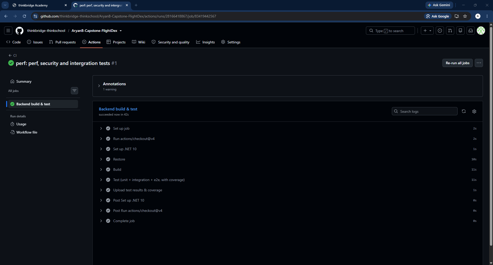
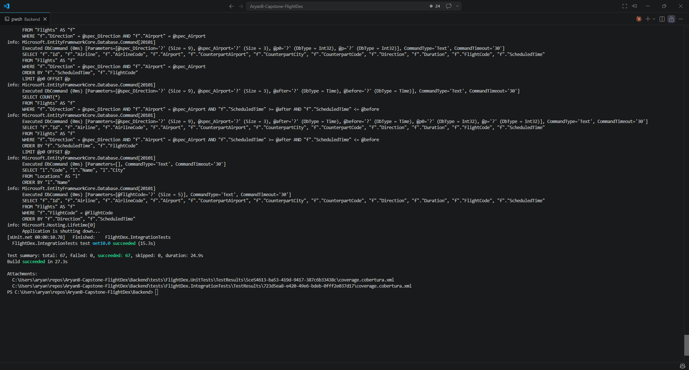
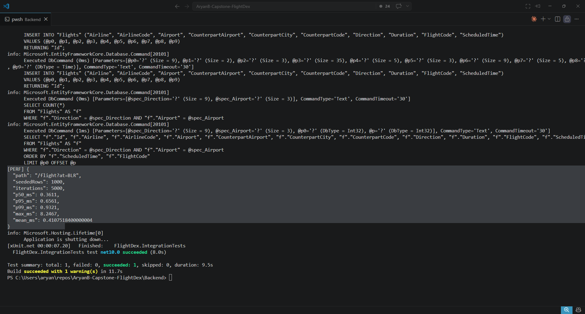
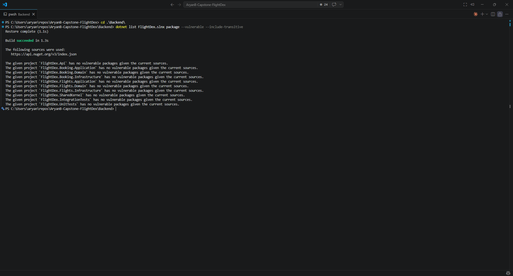

# Day 31 Piece 1 — Tests, Performance & Security Pass

Added an automated test suite covering every layer (unit, integration via
`WebApplicationFactory`, and one full end-to-end journey), ran a performance pass on the
hottest path with a before/after polish, re-checked security, and wired up a GitHub Actions
CI pipeline with a status badge in the README.

## 1. CI Run

A GitHub Actions workflow (`.github/workflows/ci.yml`) runs on every push and pull request
to `main`: it sets up .NET 10, restores, builds in Release, and runs the full test suite
with code coverage. The Run is green as proved by the badge in ReadMe.md and D31P1_Solution.md.

#### Link: https://github.com/thinkbridge-thinkschool/AryanB-Capstone-FlightDex/actions/runs/28166418867/job/83419442567

#### Screenshot: 


#### CI Run Badge: [](https://github.com/thinkbridge-thinkschool/AryanB-Capstone-FlightDex/actions/workflows/ci.yml)

## 2. Tests at Every Layer

Tests run at each layer of the onion: **unit** tests cover the domain, DTO mapping, CQRS
handlers (with mocked repositories) and security primitives; **integration** tests exercise
the repository against a real SQLite engine and the API endpoints through the full HTTP
pipeline via `WebApplicationFactory<Program>`; and one **end-to-end** test drives the whole
journey (register → search → book → list → cancel) over HTTP. Overall line coverage is
**82.6%**, with the Application and SharedKernel layers at 100%.

| Layer | Total Tests | Passed | Failed |
|---|---|---|---|
| Unit | 44 | 44 | 0 |
| Integration (API + Infrastructure) | 22 | 22 | 0 |
| End-to-End | 1 | 1 | 0 |
| **Total** | **67** | **67** | **0** |

### Output:
```pwsh
dotnet test FlightDex.slnx --collect:"XPlat Code Coverage"
```
```pwsh
Test summary: total: 67, failed: 0, succeeded: 67, skipped: 0, duration: 24.95
Build succeeded in 27.3s
```
#### Output Screenshot:


## 3. Performance (hot-path p99)

The hottest path is `GET /flight?at=BLR` — the default departures board loaded on every
visit. Measured in-process over 5,000 iterations on a 1,000-row board, the repository
previously cached only the `COUNT(*)` and re-queried the page each time. Since the timetable
is static for the life of the process, the polish caches the entire page, so repeat requests
skip SQLite and EF materialisation entirely — cutting the p99 by ~60%.

| Metric | Before | After | Change |
|---|---|---|---|
| p50 | 1.15 ms | 0.38 ms | −67% |
| p95 | 1.82 ms | 0.66 ms | −64% |
| **p99** | **2.26 ms** | **0.89 ms** | **−60%** |

### Output:
```pwsh
dotnet test FlightDex.slnx --filter "Category=Perf"
```
```pwsh
[PERF] {
    "path": "/flight?at=BLR",
    "seededRows": 1000,
    "iterations": 5000,
    "p50_ms": 0.3611,
    "p95_ms": 0.6561,
    "p99 ms": 0.9321,
    "max ms": 8.2467,
    "mean ms": 0.4107518400000004
}
```

### Output Screenshot


## 4. Security Re-check

A dependency scan surfaced two High-severity transitive CVEs
(`SQLitePCLRaw.lib.e_sqlite3` and `System.Security.Cryptography.Xml`), both remediated by
pinning patched versions in the Infrastructure projects — the scan is now clean across all
projects. The code-level posture was reviewed and confirmed sound: full JWT validation,
server-side ownership checks on tickets, PBKDF2 password hashing with constant-time
comparison, non-enumerable login, EF-parameterised queries and origin-restricted CORS. The
only open note is that the dev JWT signing key lives in `appsettings.json` and should be
sourced from an environment variable / Key Vault before deployment.

### Output:
```pwsh
dotnet list FlightDex.slnx package --vulnerable --include-transitive
```

#### Before — 2 High-severity transitive CVEs
```
> SQLitePCLRaw.lib.e_sqlite3        2.1.11   High   GHSA-2m69-gcr7-jv3q
> System.Security.Cryptography.Xml  9.0.0    High   GHSA-37gx-xxp4-5rgx / GHSA-w3x6-4m5h-cxqf
```

#### After — patched versions pinned
```Build succeeded in 1.9s

The following sources were used:
   https://api.nuget.org/v3/index.json

The given project `FlightDex.Api` has no vulnerable packages given the current sources.
The given project `FlightDex.Booking.Application` has no vulnerable packages given the current sources.
The given project `FlightDex.Booking.Domain` has no vulnerable packages given the current sources.
The given project `FlightDex.Booking.Infrastructure` has no vulnerable packages given the current sources.
The given project `FlightDex.Flights.Application` has no vulnerable packages given the current sources.
The given project `FlightDex.Flights.Domain` has no vulnerable packages given the current sources.
The given project `FlightDex.Flights.Infrastructure` has no vulnerable packages given the current sources.
The given project `FlightDex.SharedKernel` has no vulnerable packages given the current sources.
The given project `FlightDex.IntegrationTests` has no vulnerable packages given the current sources.
The given project `FlightDex.UnitTests` has no vulnerable packages given the current sources.
```

#### Output Screenshot:
